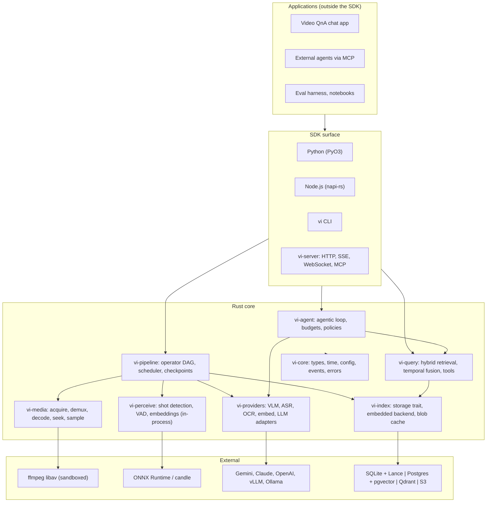
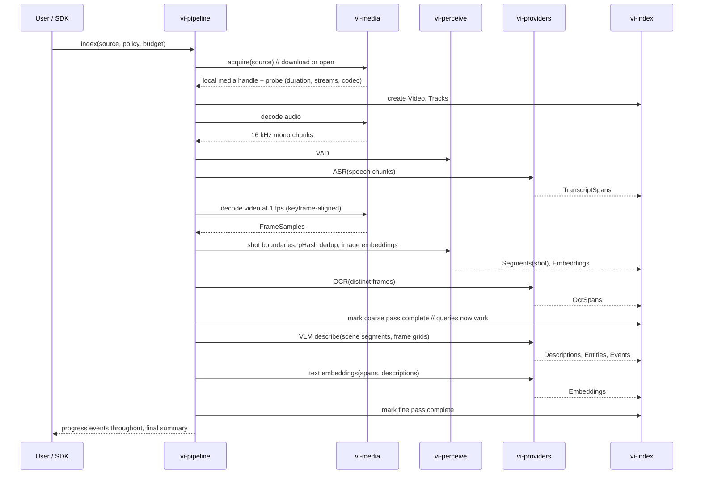
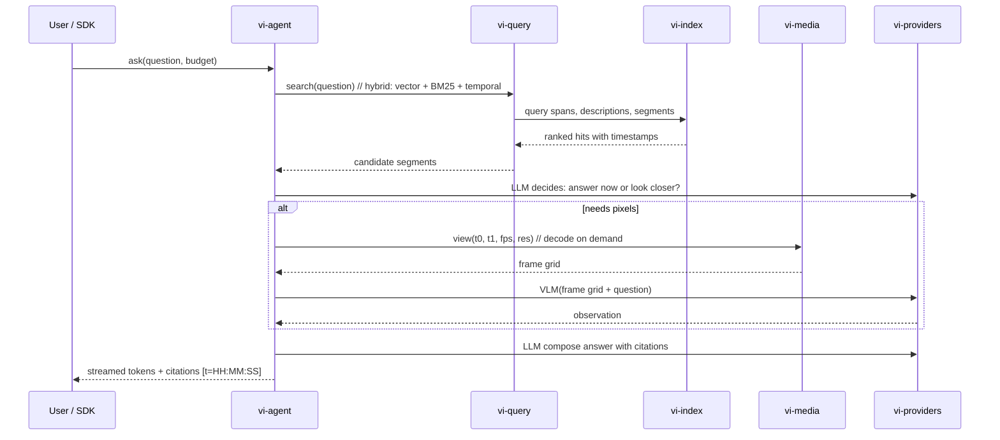

# 02. Architecture

## Layers



Dependencies point downward only. `vi-core` has no dependency on any other crate. Nothing in `Core` knows about Python, Node, or HTTP.

## Cargo workspace

```
videoindex/
  Cargo.toml                 workspace
  crates/
    vi-core/                 shared types, time model, config, events, errors
    vi-media/                acquirers, ffmpeg demux/decode, hardware decode, seeking, sampling, tiling
    vi-perceive/             in-process operators: shot boundary, pHash, VAD, image/text embeddings
    vi-providers/            provider traits + adapters, rate limiting, retries, cost accounting
    vi-index/                storage trait, embedded backend (SQLite+FTS5, Lance/usearch), blob cache
    vi-pipeline/             operator DAG, scheduler, checkpoints, progress, caching
    vi-query/                retrieval, temporal fusion, tool primitives
    vi-agent/                default agentic loop, budgets, policy trait
    vi-server/               axum HTTP/SSE/WebSocket API, MCP server
    vi-cli/                  `vi` binary
  bindings/
    python/                  PyO3 + maturin -> `videoindex` wheel
    node/                    napi-rs -> `@videoindex/core` package
  eval/                      Python: benchmark loaders, runners, reports
  apps/
    chat/                    demo QnA app (separate deployable, consumes SDK)
    site/                    videoindex.app SDK site (later)
  docs/
  dataset/
  scripts/
```

Crate responsibilities are described in the documents that follow. The one-line rule for placing code: if it needs frames, threads, storage, or sockets it goes in a `vi-*` crate. If it is a prompt, a policy, or an experiment it can start in Python and be ported to Rust once it stabilizes.

## Indexing data flow



The pipeline is a DAG of operators, not a fixed sequence. The sequence above shows the default policy. Each arrow into `vi-index` is checkpointed, so a killed job resumes.

## Query data flow



Retrieval is always tried first because it is cheap and cached. Decoding and VLM calls happen only when the agent decides the index does not contain the answer, and only within budget.

## Process model

VideoIndex runs in three shapes from the same crates:

| Shape | Entry | Use |
|---|---|---|
| **Library** | Python or Node binding | Embedded in a user's process. Pipeline and query run in the binding's tokio runtime, off the GIL / event loop. |
| **CLI** | `vi` | Batch indexing, scripting, eval. |
| **Server** | `vi-server` | Hosted or shared deployments. HTTP + SSE for answers, WebSocket for progress, MCP for agents. Multi-index, auth, quotas. |

Decoding of untrusted media always runs in a child process (`vi-media` worker) with resource limits, regardless of shape. See [03-rust-boundary](03-rust-boundary.md#security).

## Concurrency model

- One tokio runtime per process. CPU-bound work (decode, embeddings, hashing) runs on a dedicated rayon pool or in the decode worker process; the async runtime never blocks.
- Provider calls are async with per-provider concurrency limits and token-bucket rate limits.
- Frames move as `Arc<FrameBuffer>` with a pixel format tag. No copies between decode, hashing, embedding, and tiling. Frames cross the Python boundary as NumPy arrays via the buffer protocol without a copy.
- Backpressure: the scheduler bounds in-flight frames per job so an hour of 4K video never sits in memory.

## Deployment shapes

- **Local**: `pip install videoindex` or `npm install @videoindex/core`, index lives in a directory.
- **Self-hosted**: `vi serve` behind a reverse proxy, indexes on local disk or object storage.
- **Hosted (videoindex.app)**: `vi-server` with the pluggable storage backends, multi-tenant, quotas, keys. See [11-deployment](11-deployment.md).
