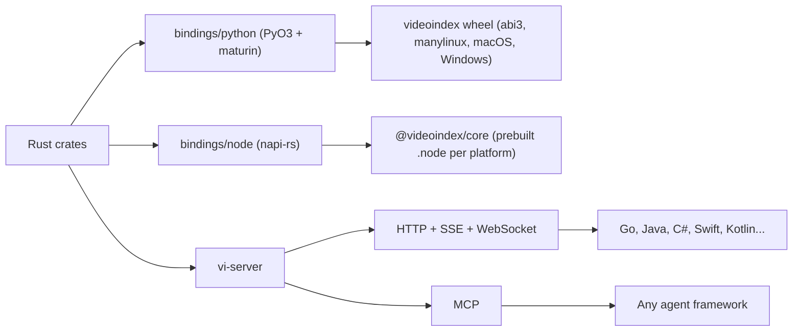
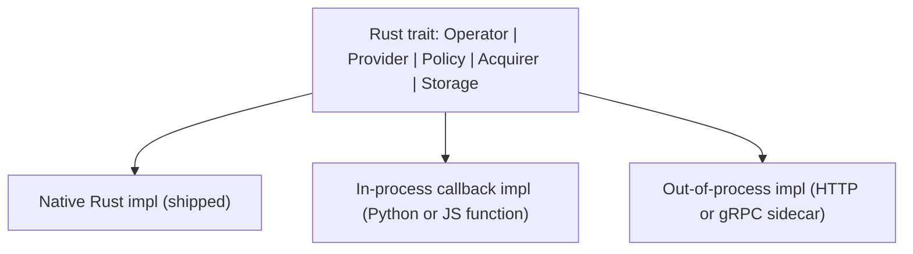

# 03. The Rust boundary

This document answers the question: how much of VideoIndex should be Rust, and how does it reach Python, Node.js, and other languages?

## Short answer

Roughly 80% of the runtime code, and 100% of the code on the hot path, is Rust. Everything that touches bytes, frames, threads, storage, or sockets lives in the Rust core. Python and JavaScript hold the parts that change weekly: prompts, agent policies, evaluation logic, and applications. Python and Node get native bindings. Every other language gets the server.

## What goes in Rust and why

| Concern | In Rust | Why Rust specifically |
|---|---|---|
| Acquire, demux, decode, seek | Yes | Zero-copy frame buffers, hardware decoders, tight control of memory for hour-long inputs. Python decode loops (OpenCV, PyAV) copy frames and serialize on the GIL. |
| Frame sampling, tiling, hashing | Yes | CPU-bound and parallel. SIMD-friendly. Runs at thousands of frames per second per core. |
| In-process perception (shot detection, VAD, embeddings) | Yes | ONNX Runtime and candle have mature Rust bindings. No Python interpreter needed in the hosted server. |
| Provider HTTP clients | Yes | Connection pooling, retries, rate limits, streaming parsers, and cost accounting are shared by all bindings. One implementation, one set of bugs. |
| Storage and retrieval | Yes | SQLite, Tantivy/FTS5, Lance, and usearch all have native Rust APIs. Query latency is dominated by this layer and must be predictable. |
| Scheduler, checkpoints, budgets | Yes | Structured concurrency with tokio. Correct cancellation and backpressure are hard to retrofit into Python. |
| Default agentic loop and tools | Yes | The loop is small, and having it in Rust means the CLI, server, and MCP all behave identically without a Python runtime. The policy is a trait so Python can override it. |
| Server, MCP | Yes | axum plus the official Rust MCP SDK. A single static binary deploys to azuremc. |

The core reasons, in order of importance for this project:

1. **Throughput on decode and sampling.** Indexing an hour of 1080p video means decoding tens of thousands of frames. In Rust with libav and hardware decode this is a few minutes on a laptop; the same in Python with per-frame copies is often the slowest part of the whole pipeline.
2. **No GIL.** Interactive queries need retrieval, decoding of a small window, and a VLM call to overlap. Rust does this in one process with real threads. The Python binding releases the GIL for every call into the core.
3. **Memory safety on untrusted input.** Video containers and codecs are a historic source of memory-corruption bugs. Rust does not fix ffmpeg's C code, but it lets us isolate it: the decoder runs in a separate sandboxed process and the rest of the system is safe Rust. A Python process embedding ffmpeg cannot offer that boundary cheaply.
4. **One core, many surfaces.** The same crates power the Python wheel, the Node package, the CLI, the server, and later WASM and mobile. Writing the core in Python would mean a Node port or a mandatory server for JavaScript users.
5. **Predictable latency.** No garbage collector pauses in the query path, and no interpreter startup in the CLI.
6. **Single binary deployment.** `vi-server` ships as one static binary plus ffmpeg. The hosted version does not need a Python environment.

## What stays in Python and JavaScript

| Concern | Language | Why not Rust |
|---|---|---|
| Prompt templates, few-shot examples | Python/JS, with Rust defaults | Iteration speed. Prompts change daily during development. Rust ships defaults so the CLI and server work without them. |
| Experimental agent policies | Python, via the `Policy` trait bridge | Researchers test new "what to watch next" strategies in notebooks. Winners get ported to Rust. |
| Evaluation harness | Python (`eval/`) | Dataset loaders, pandas, plotting, and benchmark scripts are a Python ecosystem. The harness calls the SDK; the SDK does not know about benchmarks. |
| Custom operators using PyTorch or HF models | Python, as a callback operator or a sidecar | The ML ecosystem is Python. VideoIndex never tries to load PyTorch in-process; it calls out. |
| Chat app, SDK website | TypeScript | Web applications. They consume the Node binding or the HTTP API. |

## Binding strategy

### Python: PyO3 + maturin

- Distributed as `abi3` wheels, one per platform, not per Python version. Python 3.10 and newer.
- Async: the core's tokio runtime is owned by the binding module. Python `async def` methods return awaitables via `pyo3-async-runtimes`. Synchronous methods also exist and release the GIL.
- Frames: exposed as NumPy arrays through the buffer protocol over the core's `Arc<FrameBuffer>`, no copy. Lifetimes are enforced by holding the Arc in the Python object.
- Streaming answers: an `AsyncIterator` of typed events (`token`, `tool_call`, `citation`, `done`).
- Callbacks into Python (custom operators, custom policies) go through a `PyOperator` adapter that implements the Rust `Operator` trait, acquires the GIL only for the call, and runs on a dedicated thread so a slow Python operator never blocks the runtime.
- Typed stubs (`.pyi`) generated at build time so IDEs and type checkers see the API.

### Node.js: napi-rs

- Prebuilt native modules for linux-x64, linux-arm64, darwin-arm64, darwin-x64, win32-x64. Node 20 and newer.
- Async methods return Promises. Streams are `AsyncIterable`.
- Frames are `Uint8Array` views over external buffers, no copy.
- Callbacks into JS use threadsafe functions with the same isolation rule as Python.
- TypeScript definitions generated by napi-rs.

### Everything else: server mode

Go, Java, C#, Swift, Kotlin, Ruby, and any agent framework use `vi-server`. The HTTP API is OpenAPI-described so clients can be generated. MCP exposes the same tools the internal agent uses, so an external agent can drive an index exactly as the built-in loop does.

A stable C ABI via UniFFI is deliberately deferred. It becomes worthwhile only if on-device mobile indexing is pursued; until then it is maintenance without users.

## The plugin bridge

Every extension point is a Rust trait with three kinds of implementation:

- **Native** implementations cover everything needed for the CLI and server to work alone.
- **Callback** implementations let a Python or JS function stand in for a trait method. Good for prompts, policies, and light custom logic. The bridge marshals typed structs (serde on the Rust side, dataclasses / TypeScript interfaces on the other). The language-neutral half lives in `vi_pipeline::callback`: items become JSON objects with a `kind` tag (pixels and audio samples are attached by the binding as native arrays), and rows come back as JSON (`CallbackRow`: transcript span, OCR span, shot, scene, chapter, description) that the core turns into stored rows with ids and provenance before emitting them downstream. `Scheduler::register_operator` adds the operator under a name policies can use, replacing a built-in one of the same name; `JobOptions::inline_policy` runs a policy the caller assembled at runtime. The Python binding's `PyOperator` and `PyPolicy` are thin: attribute reading, dict conversion, and the GIL-holding call on a blocking thread.
- **Sidecar** implementations are how heavy Python models plug in without loading PyTorch into the VideoIndex process: run Qwen-VL under vLLM and point the OpenAI-compatible provider at it, or expose a custom operator as a tiny HTTP service. The hosted version uses only native and sidecar implementations.

## Security

Threat model: video files, URLs, subtitles, transcripts, and on-screen text are attacker-controlled. Model outputs are untrusted. The VideoIndex process may hold API keys.

- **Sandboxed decode.** `vi-media` spawns a worker process for demux and decode. On Linux it runs under seccomp and a restricted user with memory, CPU, and file-descriptor limits; on macOS under `sandbox-exec`; on all platforms with a wall-clock timeout per job. The parent only receives frame buffers over shared memory and metadata over a length-prefixed protocol. A crash in libav kills the worker, not the index.
- **Acquire allowlist.** URL acquirers refuse private address ranges by default and enforce size and time limits. The YouTube acquirer shells out to yt-dlp with a fixed argument set and never passes user input as flags.
- **Prompt-injection defense.** Transcripts and OCR text are data. They enter prompts inside delimited, labeled blocks with provenance, and the agent's tools have no side effects beyond reading the index and decoding frames. Nothing the model says can write to the index or call the network except through the typed provider layer.
- **Provenance and integrity.** The index manifest is schema-versioned and carries content hashes of the SQLite and vector files. Optional signing lets a hosted service reject tampered indexes.
- **Secrets.** Provider keys come from environment or a key file, never from the index directory, and are redacted from logs and error messages.
- **Dependency hygiene.** `cargo-deny` and `cargo-audit` in CI, minimal `unsafe` confined to the ffmpeg FFI and buffer protocol shims, each block documented.

## Realtime efficiency

The interactive path is: question arrives, retrieval returns candidates, maybe a small decode, maybe one VLM call, stream the answer. Targets on a modest server (8 cores, no GPU): retrieval under 50 ms, decode of a 10-second window at 2 fps under 300 ms, first streamed token under 2 s excluding provider latency.

Techniques, all in the Rust core:

- **Hardware decode** through libav (VideoToolbox on macOS, NVDEC on NVIDIA, VAAPI on Linux), with software fallback.
- **Keyframe-aware seeking.** Seek to the nearest keyframe before `t0`, decode forward, drop frames before `t0`.
- **Frame grids.** Compose N frames into one tiled image with timestamp overlays so a VLM call sees a time range for the token cost of one image.
- **Perceptual dedup.** Consecutive near-identical frames (slides, static shots) collapse via pHash before any model sees them.
- **Content-addressed caches.** Every operator output is keyed by input content hash, operator version, provider, model, and prompt hash. Re-indexing with a new VLM re-runs only the VLM step.
- **Progressive index.** The coarse pass (transcript, shots, OCR, embeddings) completes first and unlocks queries. The fine pass (VLM descriptions) refines in the background.
- **Budget-aware scheduler.** Each query and job carries a budget. The scheduler prefers cached and cheap operators and stops issuing new model calls when the budget is spent.
- **Bounded memory.** In-flight frames per job are capped. Thumbnails, not full frames, are persisted.

## What we give up

- **Build complexity.** ffmpeg and ONNX Runtime are native dependencies. We vendor prebuilt static libraries per platform in CI and provide a `--features external-ffmpeg` path for distro builds.
- **Contributor pool.** Fewer people write Rust than Python. Mitigation: the extension points are Python-friendly, and the eval harness and prompts are Python.
- **Iteration speed in the core.** Compile times and type ceremony. Mitigation: start experiments in Python via the bridge, port when stable.
