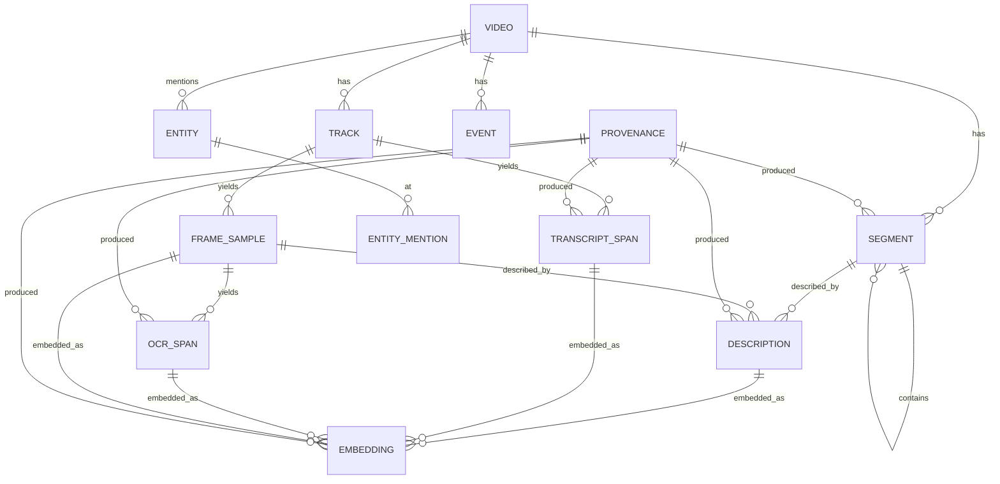

# 04. Data model

## Time model

Every timestamp in the index is a `Timestamp { num: i64, den: u32 }` rational in the source Track's timebase, plus a derived `f64` seconds column for indexing and display. Rationals avoid drift over hour-long videos with odd frame rates (29.97, 23.976). Wall-clock time, when known from container metadata, is stored once per Video as `start_wallclock` so events can be placed on a calendar without touching every row.

Ranges are half-open: `[t0, t1)`.

## Entities



### Video
| Field | Type | Notes |
|---|---|---|
| id | ULID | Stable across re-indexing of the same content |
| source_uri | text | Original location |
| content_hash | blake3 | Of the media file; drives caching and dedup |
| title, description, channel, published_at | text/ts | From container or yt-dlp metadata |
| duration | Timestamp | |
| start_wallclock | ts, nullable | |
| probe | JSON | ffprobe-equivalent output |
| index_state | enum | `acquired`, `coarse`, `fine`, `failed` |

### Track
`id, video_id, kind (video|audio|subtitle), stream_index, codec, timebase, width, height, fps, sample_rate, channels, language`.

### Segment
The retrieval unit. A hierarchy: `shot` (visual cut boundaries), `scene` (grouped shots, typically 20 s to 3 min), `chapter` (from chapters metadata, slide titles, or topic shifts, typically minutes). Every level spans the whole video with no gaps.

`id, video_id, level, parent_id, t0, t1, keyframe_sample_id, title (nullable), summary (nullable), provenance_id`.

### FrameSample
`id, track_id, t, pts, is_keyframe, phash (u64), thumbnail_blob (nullable), width, height`. Only sampled frames exist here. Full frames are never stored; they are re-decoded on demand.

### TranscriptSpan
`id, track_id, t0, t1, text, speaker (nullable), language, confidence, words (JSON, word-level timings when available), provenance_id`.

### OcrSpan
`id, frame_sample_id, t, text, bbox (x, y, w, h normalized), confidence, provenance_id`. Consecutive identical OCR text across frames is collapsed into a range on a derived view, not duplicated in storage.

### Description
Text a VLM produced about a Segment or a FrameSample. `id, target_kind (segment|frame), target_id, kind (caption|summary|qa|structured), text, structured (JSON, nullable), provenance_id`. Several Descriptions can exist for the same target from different providers, which is what enables A/B evaluation on one index.

### Entity and EntityMention
`Entity: id, video_id, kind (person|object|text|place|concept), name, canonical_name, attributes (JSON)`.
`EntityMention: entity_id, t0, t1, source_kind (transcript|ocr|description), source_id, confidence`.

### Event
`id, video_id, t0, t1, text, participants (entity ids), provenance_id`. Extracted from Descriptions and transcript by an LLM operator.

### Embedding
`id, target_kind, target_id, model, dim, vector`. Stored in the vector store, referenced from SQLite by `(target_kind, target_id, model)`. Multiple models can coexist.

### Provenance
`id, operator, operator_version, provider, model, model_version, prompt_hash, params (JSON), created_at, cost_usd, tokens_in, tokens_out, latency_ms`. Every derived row points at exactly one Provenance. Cost roll-ups per video and per configuration are a single aggregate over this table.

## Storage trait

```rust
#[async_trait]
pub trait Storage: Send + Sync {
    // metadata
    async fn put_video(&self, v: &Video) -> Result<()>;                 // upsert; VideoId is stable per content hash
    async fn get_video(&self, id: VideoId) -> Result<Option<Video>>;
    async fn find_video_by_hash(&self, content_hash: &str) -> Result<Option<Video>>;
    async fn list_videos(&self) -> Result<Vec<Video>>;
    async fn set_index_state(&self, id: VideoId, state: IndexState) -> Result<()>;
    async fn put_tracks(&self, t: &[Track]) -> Result<()>;
    async fn tracks(&self, video: VideoId) -> Result<Vec<Track>>;
    async fn put_segments(&self, s: &[Segment]) -> Result<()>;
    async fn put_frame_samples(&self, s: &[FrameSample]) -> Result<()>;
    async fn update_frame_phash(&self, updates: &[(FrameSampleId, u64)]) -> Result<()>;
    async fn update_frame_thumbnail(&self, updates: &[(FrameSampleId, BlobKey)]) -> Result<()>;
    async fn delete_frame_samples(&self, track: TrackId) -> Result<u64>;
    async fn frame_samples(&self, track: TrackId, range: Option<TimeRange>) -> Result<Vec<FrameSample>>;
    async fn put_spans(&self, s: &[Span]) -> Result<()>;               // transcript + ocr
    async fn delete_spans_by_operator(&self, track: TrackId, operator: &str) -> Result<u64>; // re-runs replace their own output
    async fn spans_by_operator(&self, video: VideoId, operator: &str) -> Result<Vec<Span>>;  // replay of cached stages
    async fn put_descriptions(&self, d: &[Description]) -> Result<()>;
    async fn put_embeddings(&self, e: &[Embedding]) -> Result<()>;
    async fn put_provenance(&self, p: &Provenance) -> Result<ProvenanceId>;
    // search
    async fn text_search(&self, q: &TextQuery) -> Result<Vec<Hit>>;    // BM25 / FTS
    async fn vector_search(&self, q: &VectorQuery) -> Result<Vec<Hit>>;
    async fn time_window(&self, video: VideoId, t0: Ts, t1: Ts, kinds: &[Kind]) -> Result<Window>;
    // blobs
    async fn put_blob(&self, key: &BlobKey, bytes: Bytes) -> Result<()>;
    async fn get_blob(&self, key: &BlobKey) -> Result<Option<Bytes>>;
    // jobs
    async fn checkpoint(&self, job: JobId, state: &JobState) -> Result<()>;
    async fn load_checkpoint(&self, job: JobId) -> Result<Option<JobState>>;
    async fn list_jobs(&self) -> Result<Vec<JobState>>;
    // maintenance
    async fn manifest(&self) -> Result<Manifest>;
    async fn stats(&self) -> Result<IndexStats>;                        // sizes and per-video counts for `vi status`
    async fn compact(&self) -> Result<()>;                              // VACUUM + refresh manifest hashes
}
```

Implementations:

| Backend | Metadata + FTS | Vectors | Blobs | Use |
|---|---|---|---|---|
| **Embedded** (default) | SQLite + FTS5 | Flat memory-mapped files per model (exact search); Lance or usearch later for approximate search | Files under `blobs/` | Local SDK, CLI, single-node server |
| **Postgres** | Postgres + tsvector | pgvector | S3/GCS/R2 | Hosted, multi-tenant |
| **Qdrant** | Postgres or SQLite | Qdrant | S3/GCS/R2 | Hosted at larger scale |

Only the embedded backend ships in v1. The trait exists from day one so the pipeline and query layers never touch SQLite directly. The trait is implemented in `vi-index`; the record types live in `vi-core::model` so `vi-media` and `vi-pipeline` share them without depending on the storage crate.

Writes to parent tables (videos, tracks, frame samples, segments) are upserts. `INSERT OR REPLACE` would delete and re-insert the row and the `ON DELETE CASCADE` constraints would silently drop every child row (see `DECISIONS.md`).

## Embedded index directory layout

```
myindex.vidx/
  manifest.json           schema_version, created_by, index ids, content hashes, optional signature
  meta.sqlite             all tables above, FTS5 virtual tables for spans and descriptions
  vectors/
    <model-name>.vec      normalised f32 rows, append-only, memory-mapped for exact search
    <model-name>.meta     per row: embedding id, video id, target kind, alive flag
  blobs/
    ab/cd/abcdef...       content-addressed: thumbnails (WebP), audio chunks (Opus), frame grids
  cache/
    operators/            operator output cache keyed by (content_hash, operator, version, provider, model, prompt_hash)
  jobs/
    <job-id>.json         checkpoints
```

Properties:
- Copy the directory anywhere and open it. No absolute paths inside.
- `manifest.json` is the only file a reader must parse before deciding whether it can open the index. Unknown newer schema versions are refused with a clear error; older ones are migrated in place with a backup.
- `cache/` and `blobs/thumbnails` are safe to delete; they regenerate on demand from the source media if it is still reachable.
- Sizes: roughly 30 to 80 MB per hour of video, dominated by thumbnails and embeddings. Tunable by thumbnail resolution and sampling rate.

## Full-text and vector search details

- FTS5 with the `unicode61` tokenizer and prefix indexes for spans and descriptions. BM25 ranking. Tantivy is an alternative if FTS5 ranking quality proves limiting; the trait hides the choice.
- Vectors live in flat per-model files searched exactly (brute force, parallel); the `embeddings` table maps each row back to its target and the `.meta` file carries the video id and target kind so filters apply before scoring. An approximate index (Lance IVF-PQ or usearch HNSW) can replace the file behind the trait when tables grow past a few million rows.
- Temporal fusion, described in [06-query-and-agents](06-query-and-agents.md), happens above the storage layer.

## Schema versioning

The schema version is a single integer in `manifest.json` and in a `schema_meta` table. Migrations are Rust functions registered in order. Every migration is tested against fixture indexes produced by the previous version.
