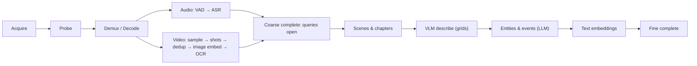

# 05. Indexing pipeline

Indexing turns a Source into a populated Index. It is a DAG of typed Operators run by a scheduler under a budget, with every output checkpointed and cached.

## Stages



### Acquire

The `Acquirer` trait resolves a Source to a local, seekable media file plus metadata.

| Acquirer | Handles | Notes |
|---|---|---|
| `LocalFile` | paths | Zero-copy open |
| `ObjectStore` | `s3://`, `gs://`, `r2://`, `az://` | Via the `object_store` crate. Ranged reads allow probing without full download; full download for decode. |
| `Http` | `https://…/file.mp4` | Size and time limits, resumable, private-range blocked |
| `YtDlp` | YouTube, playlists, other sites yt-dlp supports | Shells out to `yt-dlp` with a fixed argument list: best video up to 720p plus best audio, merge to MP4, write `.info.json`, subtitles and auto-captions if present, download archive for idempotence. Playlists expand into one Source per entry. Absence of yt-dlp is a clear error with install hint. YouTube blocks most datacenter IPs, so on servers the usual path is files downloaded elsewhere and transferred; `LocalFile` imports the yt-dlp `.info.json` and subtitle sidecars next to a file so those transfers keep title, chapters, and captions. |

Acquired media lands in a content-addressed media cache (`/data/videoindex/videos/<hash>.mp4` on servers; a configurable directory locally). Existing subtitles from acquisition are imported as a `subtitle` Track and can seed the transcript, saving ASR cost when they are human-authored.

### Probe

libav-based probe: duration, streams, codecs, frame rate, resolution, keyframe interval estimate, chapter markers, embedded metadata. Stored on the Video record. Decides the decode plan (hardware or software, target sampling rate, whether audio exists).

### Demux and decode

Runs in the sandboxed `vi-media` worker. Two independent streams:

- **Audio**: decoded and resampled to 16 kHz mono PCM, chunked at 30 s with 1 s overlap, aligned to VAD boundaries when available.
- **Video**: decoded at a sampling policy's rate (default 1 fps for the coarse pass), keyframe-aligned seeking so scrubbing an hour does not decode the full stream. Frames are delivered as `Arc<FrameBuffer>` (RGB24 or NV12) with PTS.

Hardware decode is auto-detected: VideoToolbox, NVDEC, VAAPI, else software. Decoding falls back to software on any hardware error for that job.

### Audio operators

| Operator | Where | Output |
|---|---|---|
| `Vad` | in-process (Silero via ONNX) | speech ranges |
| `Asr` | provider (Whisper via OpenAI-compatible or local server, Gemini, Deepgram-style) | TranscriptSpans with word timings when the provider gives them |
| `Diarize` | provider, optional | speaker labels on spans |

Only speech ranges are sent to ASR. An hour of lecture with 40 minutes of speech costs 40 minutes of ASR. `Vad` decodes the whole track, scores it in one batched pass, merges speech across pauses under `models.vad.min_silence_ms`, drops runs under `min_speech_ms`, pads by `pad_ms`, and splits runs longer than `max_segment_secs` at their quietest window. Each `SpeechRange` item carries its PCM so `Asr` never re-decodes. `Asr` sends `models.asr.concurrency` requests at a time through the `asr` role, splits the returned segments on word timings into spans of about `span_secs`, and writes one `Provenance` row per request.

### Video operators

| Operator | Where | Output |
|---|---|---|
| `Sample` | in-process | FrameSamples at policy rate |
| `ShotBoundary` | in-process (HSV histogram distance + edge change ratio, adaptive threshold) | shot Segments |
| `PHash` | in-process | 64-bit perceptual hash per FrameSample; consecutive frames within Hamming distance 6 collapse for downstream operators |
| `ImageEmbed` | in-process (SigLIP or CLIP via ONNX) or provider | Embeddings for distinct FrameSamples |
| `Ocr` | provider (VLM with OCR prompt, PaddleOCR sidecar, cloud OCR) or in-process (RapidOCR ONNX) | OcrSpans for distinct frames whose text-likelihood heuristic fires |
| `Thumbnail` | in-process | WebP thumbnail per FrameSample at 320 px |

### Coarse complete

Once the audio and video operators above finish, the Video is marked `coarse`. Transcript search, OCR search, image-embedding search, and shot navigation all work. For lectures and talks, most questions are answerable here without a VLM.

### Scene and chapter grouping

- **Scenes**: shots grouped by image-embedding similarity and transcript continuity, targeting 20 s to 3 min.
- **Chapters**: from container chapter markers or yt-dlp chapters when present; otherwise topic segmentation over the transcript (TextTiling-style over sentence embeddings) combined with slide-title OCR changes.

### VLM describe

For each scene, compose a frame grid (default 3×3 of dedup'd keyframes with timestamp labels) and ask the VLM for a structured description: what is shown, on-screen text, people or objects, actions, and a one-line summary. Providers with native video input receive the clip directly instead of a grid, controlled by capability negotiation in [07-model-providers](07-model-providers.md). The transcript for the scene is included in the prompt as labeled data so the description is grounded in speech.

Default budget: one VLM call per scene. Policies can request denser coverage for sections with high visual change or on demand from a query.

### Entities and events

An LLM operator reads scene descriptions plus transcript in sliding windows and emits Entities, EntityMentions, and Events with time ranges. Entities are canonicalized across the video by name and embedding similarity.

### Text embeddings

All TranscriptSpans, OcrSpans, Descriptions, and Segment summaries are embedded with the configured text embedding model. Spans are embedded in windows of roughly 30 s with overlap so retrieval hits carry enough context.

## Operator contract

```rust
#[async_trait]
pub trait Operator: Send + Sync {
    fn id(&self) -> &'static str;           // e.g. "shot_boundary"; also the stage name in checkpoints
    fn version(&self) -> u32;               // bump when output semantics change
    fn inputs(&self) -> &[InputKind];       // what it consumes
    fn outputs(&self) -> &[OutputKind];     // what it produces
    fn cost_estimate(&self, input: &InputSummary) -> CostEstimate;
    async fn run(&self, ctx: &OpContext, input: OpInput) -> Result<OpOutput>;   // one input item per call
    async fn finish(&self, ctx: &OpContext) -> Result<OpOutput> { Ok(Default::default()) } // after the last input
}
```

The scheduler derives the DAG from `inputs` and `outputs`. Adding an operator never requires editing the scheduler. `OpContext` gives access to providers, storage and the blob store, the budget, a cancellation token, progress reporting, and `emit`: operators stream each output item through `ctx.emit(item)` rather than returning a `Vec`, so an hour of frames never sits in memory and backpressure from bounded channels reaches the decoder. `finish` runs once after the last input so operators can flush batched storage writes. Input kinds are one enum (`ItemKind`: `Media`, `Frame`, `Hashed`, `Thumbnail`, `AudioChunk`, ...); every job starts by feeding the single `Media` item to the operators that declare it as input.

## Scheduler

- Builds the DAG for a job from the chosen `IndexPolicy` (which operators, which providers, sampling rates).
- Runs operators as tokio tasks, with CPU-bound ones dispatched to the rayon pool and decode to the worker process.
- Bounded channels between operators provide backpressure; at most N frames are in flight per job. N is the decode worker's shared-memory slot count (`media.worker.max_in_flight_frames`), and channel capacities are derived from it so a slow consumer stalls the decoder instead of deadlocking it.
- Provider calls go through per-provider semaphores and rate limiters. Batched where the provider supports it.
- Every operator output is written to storage and the job checkpoint (`jobs/<job-id>.json`) is updated when a stage starts, finishes, or fails. A completed stage also leaves a marker in the operator output cache (below). Re-running a job plans each stage as *skip* (cached, no running consumer needs its items), *replay* (cached, a consumer needs its items and the operator can re-emit them from storage), or *run* (not cached, or a producer runs and so its inputs changed). `sample` cannot replay, so anything needing frames re-decodes; text stages (`subtitle_import`, `asr`, `ocr`) and `shot_boundary` replay.
- Cancellation propagates through the DAG in under a second; partial results remain queryable.
- Emits `Progress` events: stage, fraction complete, cost so far, ETA.

## Caching

Operator outputs are cached under a key of `(input content hash, operator id, operator version, provider, model, model version, prompt hash, params hash)`; in the embedded backend the outputs are the index rows themselves and the cache is a marker file per key under `cache/operators/`. Consequences:

- Re-running with a different VLM re-runs only the VLM stage and downstream stages that depend on it.
- Two Videos with identical content share every cached output.
- The eval harness can sweep providers over the same 100 hours of video without re-decoding anything.

## Budgets and policies

An `IndexPolicy` is a named configuration:

```toml
[policy.lecture_default]
sample_fps = 1.0
coarse = ["vad", "asr", "shot_boundary", "phash", "image_embed", "ocr", "thumbnail"]
fine   = ["scenes", "chapters", "vlm_describe", "entities_events", "text_embed"]
vlm_grid = "3x3"
max_cost_usd_per_hour = 2.0
max_wallclock_per_hour = "20m"

[policy.coarse_only]
fine = []
```

When a budget is exhausted the job stops issuing new provider calls, finishes writing what it has, marks the Video with the reached state, and reports which stages were skipped. `max_wallclock_per_hour` accepts `20m`, `1h30m`, `90s`; `0` for either limit means unlimited. The ceiling is the per-hour figure times the video's duration in hours (at least one minute's worth).

## Progressive indexing

Indexing and querying can overlap. A query against a Video in `coarse` state uses what exists and reports the index state in its response so the caller can decide to wait, proceed, or trigger a targeted fine pass for the segments the query touched. The agent's `describe(t0, t1)` tool is exactly such a targeted fine pass: it runs the VLM operator for one range and stores the result, so the index improves with use.

## Failure handling

- Corrupt or truncated media: probe reports what is decodable; indexing proceeds over the readable range and records the gap.
- Provider errors: retried with backoff and jitter; after the retry budget, the operator marks the affected inputs as `failed` with the error and the job continues. A summary lists failed ranges.
- Worker crash: the job restarts the worker and resumes from checkpoint; three crashes on the same range mark that range failed.
