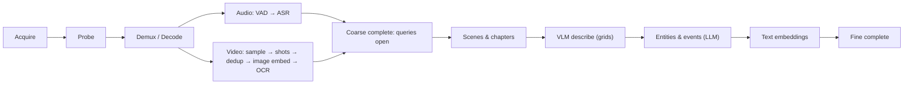

# 05. Indexing pipeline

Indexing turns a Source into a populated Index. It is a DAG of typed Operators run by a scheduler under a budget, with every output checkpointed and cached.

## Stages


```mermaid
flowchart LR
    A["Acquire"] --> P["Probe"] --> D["Demux / Decode"]
    D --> AU["Audio: VAD → ASR"]
    D --> VI["Video: sample → shots → dedup → image embed → OCR"]
    AU & VI --> C["Coarse complete: queries open"]
    C --> SC["Scenes & chapters"] --> VLM["VLM describe (grids)"] --> EX["Entities & events (LLM)"] --> TE["Text embeddings"] --> F["Fine complete"]
```

### Acquire

The `Acquirer` trait resolves a Source to a local, seekable media file plus metadata.

| Acquirer | Handles | Notes |
|---|---|---|
| `LocalFile` | paths | Zero-copy open |
| `ObjectStore` | `s3://`, `gs://`, `r2://`, `az://` | Via the `object_store` crate. Ranged reads allow probing without full download; full download for decode. |
| `Http` | `https://…/file.mp4` | Size and time limits, resumable, private-range blocked |
| `YtDlp` | YouTube, playlists, other sites yt-dlp supports | Shells out to `yt-dlp` with a fixed argument list: best video up to 720p plus best audio, merge to MP4, write `.info.json`, subtitles and auto-captions if present, download archive for idempotence. Playlists expand into one Source per entry. Absence of yt-dlp is a clear error with install hint. YouTube blocks most datacenter IPs, so on servers the usual path is files downloaded elsewhere and transferred; `LocalFile` imports the yt-dlp `.info.json` and subtitle sidecars next to a file so those transfers keep title, chapters, and captions. |

Acquired media lands in a content-addressed media cache (`/data/videoindex/videos/<hash>.mp4` on servers; a configurable directory locally). Existing subtitles from acquisition are imported as a `subtitle` Track and can seed the transcript, saving ASR cost when they are human-authored.

### Probe

libav-based probe: duration, streams, codecs, frame rate, resolution, keyframe interval estimate, chapter markers, embedded metadata. Stored on the Video record. Decides the decode plan (hardware or software, target sampling rate, whether audio exists).

### Demux and decode

Runs in the sandboxed `vi-media` worker. Two independent streams:

- **Audio**: decoded and resampled to 16 kHz mono PCM, chunked at 30 s with 1 s overlap, aligned to VAD boundaries when available.
- **Video**: decoded at a sampling policy's rate (default 1 fps for the coarse pass), keyframe-aligned seeking so scrubbing an hour does not decode the full stream. Frames are delivered as `Arc<FrameBuffer>` (RGB24 or NV12) with PTS.

Hardware decode is auto-detected: VideoToolbox, NVDEC, VAAPI, else software. Decoding falls back to software on any hardware error for that job.

#### The recording as the decode source

A stream is never decoded from the network. The live ingest (`videoindex-live`'s realtime-core) writes it into a segmented recording, the live store of [04-data-model](04-data-model.md#the-live-store-the-indexs-neighbour), and the worker decodes from that recording through `MediaInput::Segments`. Reconnects, playlist logic and wall-clock mapping stay in the ingest; the recording is also the DVR that keeps `view` working on a live video.

`vi_media::decode_live(cfg, LiveDecodeRequest { input, fps, max_dim, sample_rate, chunk_secs, tick_secs })` is the live counterpart of `decode_video` plus `decode_audio`: one long-lived worker per stream makes one pass over the feed and yields `LiveItem`s in packet order:

| Item | Meaning |
|---|---|
| `Frame(Arc<FrameBuffer>)` | a sampled frame at `fps`, `t` on the recording's timeline |
| `Audio(AudioChunk)` | `chunk_secs` of 16 kHz mono PCM, chunks contiguous and timed by sample count from the first sample (the file decoder's rule), so chunk boundaries do not depend on where segments are cut |
| `Tick { head }` | everything up to `head` has been delivered; emitted after the segment whose end crossed another `tick_secs` of stream time, and once more at the head before `End`. `head` is a listed segment's end, never past the last one |
| `Gap { t0, t1 }` | the index has no media for `[t0, t1)`; the audio run is flushed before it and the clock re-anchored after it; frame times skip it |
| `End` | the index says `ended`, or the feed is not followed and the last listed segment is done |

Inside the worker every segment is opened on its own (one libav input context per segment: the S0.5 measurement put a fresh open at about 100 ms, a third of the budget, and reading TS segments as one byte stream corrupts the last packet of each), the video decoder is rebuilt per segment (segments start at a keyframe), and the audio decoder and resampler continue across contiguous segments so nothing is lost at the cut. Times come from the index, `entry.t0` plus the offset from the segment's first video PTS, for audio as for video. With `follow` set on the feed the worker waits at the index for the next segment (100 ms poll; the worker's per-message idle timeout applies between segments, so `media.worker.timeout_secs` bounds how long a stalled writer is tolerated) and returns when the index says `ended`.

Window decodes (`decode_video` or `decode_audio` with `t0`/`t1`) over `MediaInput::Segments` open only the segments that hold a sampling target inside the window (`SegmentIndex::covering`, then skipping segments no target falls in), log each opened file at debug level, and sample across them on the recording's timeline: a 5 s window at 1 fps over 2 s segments opens three files, which is how `view` on a live video stays under its latency budget. The file paths of `decode_video` and `decode_audio` are untouched by all of this: batch indexing produces the same rows as before.

### Audio operators

| Operator | Where | Output |
|---|---|---|
| `Vad` | in-process (Silero via ONNX) | speech ranges |
| `Asr` | provider (Whisper via OpenAI-compatible or local server, Gemini, Deepgram-style) | TranscriptSpans with word timings when the provider gives them |
| `Diarize` | provider, optional | speaker labels on spans |

Only speech ranges are sent to ASR. An hour of lecture with 40 minutes of speech costs 40 minutes of ASR. `Vad` decodes the whole track, scores it in one batched pass, merges speech across pauses under `models.vad.min_silence_ms`, drops runs under `min_speech_ms`, pads by `pad_ms`, and splits runs longer than `max_segment_secs` at their quietest window. Each `SpeechRange` item carries its PCM so `Asr` never re-decodes. `Asr` sends `models.asr.concurrency` requests at a time through the `asr` role, splits the returned segments on word timings into spans of about `span_secs`, and writes one `Provenance` row per request.

### Video operators

| Operator | Where | Output |
|---|---|---|
| `Sample` | in-process | FrameSamples at policy rate |
| `ShotBoundary` | in-process (HSV histogram distance + edge change ratio, adaptive threshold) | shot Segments |
| `PHash` | in-process | 64-bit perceptual hash per FrameSample; consecutive frames within Hamming distance 6 collapse for downstream operators |
| `ImageEmbed` | in-process (SigLIP or CLIP via ONNX) or provider | Embeddings for distinct FrameSamples |
| `Ocr` | provider (VLM with OCR prompt, PaddleOCR sidecar, cloud OCR) or in-process (RapidOCR ONNX) | OcrSpans for distinct frames whose text-likelihood heuristic fires |
| `Thumbnail` | in-process | WebP thumbnail per FrameSample at 320 px |

### Coarse complete

Once the audio and video operators above finish, the Video is marked `coarse`. Transcript search, OCR search, image-embedding search, and shot navigation all work. For lectures and talks, most questions are answerable here without a VLM.

### Scene and chapter grouping

- **Scenes**: shots grouped by image-embedding similarity and transcript continuity, targeting 20 s to 3 min.
- **Chapters**: from container chapter markers or yt-dlp chapters when present; otherwise topic segmentation over the transcript (TextTiling-style over sentence embeddings) combined with slide-title OCR changes.

### VLM describe

For each scene, compose a frame grid (default 3×3 of dedup'd keyframes with timestamp labels) and ask the VLM for a structured description: what is shown, on-screen text, people or objects, actions, and a one-line summary. Providers with native video input receive the clip directly instead of a grid, controlled by capability negotiation in [07-model-providers](07-model-providers.md). The transcript for the scene is included in the prompt as labeled data so the description is grounded in speech.

Default budget: one VLM call per scene. Policies can request denser coverage for sections with high visual change or on demand from a query.

### Entities and events

An LLM operator reads scene descriptions plus transcript in sliding windows and emits Entities, EntityMentions, and Events with time ranges. Entities are canonicalized across the video by name and embedding similarity.

### Text embeddings

All TranscriptSpans, OcrSpans, Descriptions, and Segment summaries are embedded with the configured text embedding model. Spans are embedded in windows of roughly 30 s with overlap so retrieval hits carry enough context.

## Operator contract

```rust
#[async_trait]
pub trait Operator: Send + Sync {
    fn id(&self) -> &'static str;           // e.g. "shot_boundary"; also the stage name in checkpoints
    fn version(&self) -> u32;               // bump when output semantics change
    fn inputs(&self) -> &[InputKind];       // what it consumes
    fn outputs(&self) -> &[OutputKind];     // what it produces
    fn cost_estimate(&self, input: &InputSummary) -> CostEstimate;
    async fn run(&self, ctx: &OpContext, input: OpInput) -> Result<OpOutput>;   // one input item per call
    async fn finish(&self, ctx: &OpContext) -> Result<OpOutput> { Ok(Default::default()) } // after the last input
}
```

The scheduler derives the DAG from `inputs` and `outputs`. Adding an operator never requires editing the scheduler. `OpContext` gives access to providers, storage and the blob store, the budget, a cancellation token, progress reporting, and `emit`: operators stream each output item through `ctx.emit(item)` rather than returning a `Vec`, so an hour of frames never sits in memory and backpressure from bounded channels reaches the decoder. `finish` runs once after the last input so operators can flush batched storage writes. Input kinds are one enum (`ItemKind`: `Media`, `Frame`, `Hashed`, `Thumbnail`, `AudioChunk`, ...); every job starts by feeding the single `Media` item to the operators that declare it as input.

## Scheduler

- Builds the DAG for a job from the chosen `IndexPolicy` (which operators, which providers, sampling rates).
- Runs operators as tokio tasks, with CPU-bound ones dispatched to the rayon pool and decode to the worker process.
- Bounded channels between operators provide backpressure; at most N frames are in flight per job. N is the decode worker's shared-memory slot count (`media.worker.max_in_flight_frames`), and channel capacities are derived from it so a slow consumer stalls the decoder instead of deadlocking it.
- Provider calls go through per-provider semaphores and rate limiters. Batched where the provider supports it.
- Every operator output is written to storage and the job checkpoint (`jobs/<job-id>.json`) is updated when a stage starts, finishes, or fails. A completed stage also leaves a marker in the operator output cache (below). Re-running a job plans each stage as *skip* (cached, no running consumer needs its items), *replay* (cached, a consumer needs its items and the operator can re-emit them from storage), or *run* (not cached, or a producer runs and so its inputs changed). `sample` cannot replay, so anything that *runs* and needs frames re-decodes; text stages (`subtitle_import`, `asr`, `ocr`) and `shot_boundary` replay, and a replaying stage does not make its own producers run (a fine pass over a coarse index touches no pixels). A replaying stage only re-emits its stored rows: it is not run on the media item, which for `asr` would delete its transcript and for `subtitle_import` would import the sidecars again under new ids. A job killed while a stage was re-writing its rows leaves that stage's marker in place over partial rows; re-run that video with `--force`.
- Cancellation propagates through the DAG in under a second; partial results remain queryable.
- Emits `Progress` events: stage, fraction complete, cost so far, ETA.

## Live jobs: a pipeline that never sees the end

A stream is indexed by the same scheduler and operators as a file, with these differences (live C3; the live modules in `videoindex-live` drive them):

- **Entry point.** `Scheduler::run_with_media(media, opts, cancel)` runs the policy over a `MediaItem` the caller built: the recording as `MediaInput::Segments`, the `Video` row the caller owns (identity hash, `index_state = live`), `expected_samples: None` because the length is not known. `run` is acquire, probe, register, then the same machinery. Progress events carry `head` (the stream time reached) instead of a fraction when the total is unknown.
- **`JobOptions.live`.** Nothing is cached or replayed (the recording is unique and unfinished), `index_state` is not written at the end (the caller owns the state of a live video), the budget is `Budget::for_live`, and cancelling the job is its normal end: stages complete, `JobReport.stopped_at` carries the head reached.
- **Ticks.** The root operator of a live policy (`live_demux` in realtime-core, registered through `Scheduler::register_operator`; the core needs only the item kinds and the entry point) consumes the media item and emits `Frame`, `AudioChunk` and `Tick { head }` items, a tick every `tick_secs` of stream time. Each consumer receives only the kinds it declares, so `phash` never sees audio. An operator that lists `Tick` among its inputs flushes on it: `phash` and `thumbnail` write the row updates waiting for a batch, `image_embed` and `text_embed` embed what is waiting, `shot_boundary` upserts the open shot with `t1 = head` and emits the shots that closed (stable ids across ticks; when the stream ends, `finish` closes the last one at the head instead of rewriting the level). Batch policies have no producer of ticks, so no batch behaviour changes.
- **`last_t`.** In a live job every item a stage processes moves the stage's clock to that item's time, and a tick moves it to `head`, so every operator that received the tick records `last_t = head`. The clock is written into the checkpoint every second while the job runs and into `JobReport.stages[*].last_t` at the end; the live indexer computes `watermark = min(last_t)` over the coarse stages it names. For `asr` the clock is the issue time of its last request, so transcript lag is read from the rows themselves.
- **`vad_stream`.** Voice activity over `AudioChunk` items with `vi_perceive::vad::Vad::push` (a scorer trait, so tests script one): `vad`'s hysteresis, `min_silence` merge, `min_speech` drop and padding, an utterance never longer than 15 s (the transcript span length), and a flush at most 3 s after speech ends or on a tick. A hole in the audio (a `Gap` in the recording) flushes what is open and re-anchors the clock. `vad` is untouched; live policies name `vad_stream` in its place.
- **`asr` in flight.** Requests in flight per job default to 2 when live (several streams share one ASR server fairly) and to `models.asr.concurrency` otherwise; `Asr::with_max_in_flight` takes a shared knob a lag policy can raise while the job runs.
- **Budget.** `Budget::for_live(policy)` applies `max_cost_usd_per_hour` to the trailing hour of stream time (the scheduler advances the window on every tick): a burst of spend pauses provider calls until enough of the stream has passed, and the budget opens again. The wall-clock ceiling per hour compares wall time spent with stream time covered in the same window, so a live policy sets `max_wallclock_per_hour` to `0` or above an hour; anything lower pauses calls whenever indexing lags the stream.

The regression guard for all of this is a batch run of the model-free coarse stages on the fixture whose row counts and cache markers are pinned in `crates/vi-pipeline/tests/pipeline.rs`, plus the 50-question dev set after each pipeline change.

## Caching

Operator outputs are cached under a key of `(input content hash, operator id, operator version, provider, model, model version, prompt hash, params hash)`; in the embedded backend the outputs are the index rows themselves and the cache is a marker file per key under `cache/operators/`. Consequences:

- Re-running with a different VLM re-runs only the VLM stage and downstream stages that depend on it.
- Two Videos with identical content share every cached output.
- The eval harness can sweep providers over the same 100 hours of video without re-decoding anything.

## Budgets and policies

An `IndexPolicy` is a named configuration:

```toml
[policy.lecture_default]
sample_fps = 1.0
coarse = ["subtitle_import", "vad", "asr", "sample", "shot_boundary", "phash", "thumbnail", "image_embed", "ocr", "text_embed"]
fine   = ["scenes", "chapters", "vlm_describe", "entities_events"]
vlm_grid = "3x3"
max_cost_usd_per_hour = 2.0
max_wallclock_per_hour = "20m"

[policy.coarse_only]
fine = []
```

`default_policy = "auto"` (the default) picks `coarse_only` when the `asr`, `ocr`, `image_embed` and `text_embed` roles are bound and `coarse_local` (no provider-backed operators) otherwise. `text_embed` sits in the coarse pass because hybrid search needs span vectors; the fine pass adds the VLM and LLM stages in M2.

When a budget is exhausted the job stops issuing new provider calls, finishes writing what it has, marks the Video with the reached state, and reports which stages were skipped. `max_wallclock_per_hour` accepts `20m`, `1h30m`, `90s`; `0` for either limit means unlimited. The ceiling is the per-hour figure times the video's duration in hours (at least one minute's worth).

## Progressive indexing

Indexing and querying can overlap. A query against a Video in `coarse` state uses what exists and reports the index state in its response so the caller can decide to wait, proceed, or trigger a targeted fine pass for the segments the query touched. The agent's `describe(t0, t1)` tool is exactly such a targeted fine pass: it runs the VLM operator for one range and stores the result, so the index improves with use.

## Failure handling

- Corrupt or truncated media: probe reports what is decodable; indexing proceeds over the readable range and records the gap.
- Provider errors: retried with backoff and jitter; after the retry budget, the operator marks the affected inputs as `failed` with the error and the job continues. A summary lists failed ranges.
- Worker crash: the job restarts the worker and resumes from checkpoint; three crashes on the same range mark that range failed.
