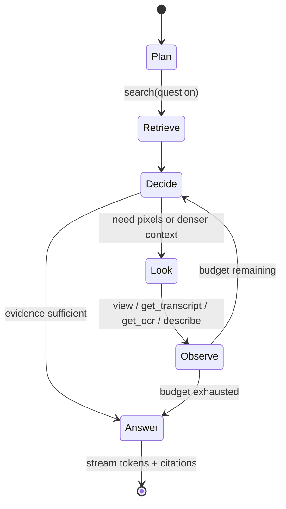

# 06. Query and agents

Two entry points share one engine:

- `search(...)`: deterministic retrieval, returns ranked timestamped hits. No model call unless the caller asks for reranking.
- `ask(...)`: the agentic loop. Uses search first, then decides whether to look at pixels, then composes an answer with citations. Streams.

## Retrieval

### Hybrid search

For a query string, `vi-query` runs in parallel:

1. **BM25** over TranscriptSpans, OcrSpans, Descriptions, and Segment summaries.
2. **Text vector** search over the same, using the configured text embedding model.
3. **Image vector** search over FrameSample embeddings, using the text tower of the same image-text model (SigLIP or CLIP), so a query such as "slide with the architecture diagram" matches frames directly.

Results are fused with reciprocal rank fusion, then passed through **temporal fusion**: hits are grouped into their scene Segments and a scene's score aggregates its hits with a decay for distance from the densest cluster. This rewards a scene where the transcript, on-screen text, and description all agree over a scene with one lucky keyword match.

Filters: video ids, time range, source kind (transcript, ocr, description, frame), speaker, entity.

Optional **reranking** with a cross-encoder provider or an LLM over the top 30 candidates.

### Output

```json
{
  "hits": [
    {
      "video_id": "01J...",
      "segment_id": "01J...",
      "t0": 1834.2, "t1": 1901.7,
      "score": 0.83,
      "evidence": [
        {"kind": "transcript", "t0": 1840.0, "t1": 1852.5, "text": "...so the retriever returns ..."},
        {"kind": "ocr", "t": 1845.0, "text": "Hybrid retrieval: BM25 + dense"},
        {"kind": "description", "text": "Speaker at podium; slide showing a two-column diagram ..."}
      ],
      "thumbnail": "blob:ab/cd/..."
    }
  ],
  "index_state": "fine"
}
```

## The agentic loop

The loop follows the agentic-video idea: the model chooses what to watch, at what rate, through which modality, under a budget.



The loop is implemented in `vi-agent` around a `Policy` trait:

```rust
#[async_trait]
pub trait Policy: Send + Sync {
    async fn next_step(&self, state: &AgentState) -> Result<Step>; // Step::Tool(call) | Step::Answer
}
```

The default policy is a tool-using LLM: it receives the question, the retrieval hits, the observations so far, and the remaining budget, and picks a tool call or answers. Python and JS can supply their own `Policy` through the bridge. Fixed strategies such as "always view the top-3 scenes at 1 fps then answer" are also policies and are useful as eval baselines.

The reasoning model is the `agent_llm` role (`agent_vlm` when bound) unless the caller picks one per question: `ask` takes `model`, a `[providers.*]` name or its model id (`vi ask --model gemini-3.8-flash`, `idx.ask(q, model=...)`, `{"model": ...}` over HTTP; `GET /v1/models` lists the chat providers and marks the default). The tools keep their own roles, so switching the model changes who reasons, not how the index is read. Gemini 3 function calls carry a thought signature that must return with the call in later turns; the tool call keeps it as an opaque `signature` and the Gemini adapter echoes it.

### Tools

Every tool is read-only against the index and the media. Tools are exposed identically to the internal LLM, to Python/JS callers, and over MCP.

| Tool | Arguments | Returns | Cost class |
|---|---|---|---|
| `search` | query, filters, k, per_video_k | ranked hits with evidence, at most `per_video_k` per video (default 3 when more than one video is in scope) | cheap, cached |
| `find_mentions` | terms[], prefix?, kinds?, video_ids?, per_video | exhaustive FTS scan: per video, hit counts per kind and the earliest hits with timestamps and snippets; the tool for "which videos mention X" | cheap, deterministic |
| `count_mentions` | terms[], group_by (library, video, channel), prefix?, kinds?, video_ids? | rows containing each term per kind, videos with a hit, optional per-video or per-channel breakdown; the tool for "discussed most", rankings, totals | cheap, deterministic |
| `library_stats` | — | video count, total duration, channels with counts, every video's title, channel, duration and date | cheap |
| `list_videos` | — | ids, titles, durations | cheap |
| `timeline` | video_id, level | segments with titles and summaries | cheap |
| `get_transcript` | video_id, t0, t1 | transcript text with timestamps and speakers | cheap |
| `get_ocr` | video_id, t0, t1 | on-screen text with timestamps | cheap |
| `get_descriptions` | video_id, t0, t1 | existing VLM descriptions | cheap |
| `view` | video_id, t0, t1, fps, resolution, layout | frame grid image(s) with timestamp labels, plus transcript for the window | decode + VLM tokens |
| `describe` | video_id, t0, t1, question? | runs the VLM on the window, stores the Description, returns text | decode + VLM call, improves index |
| `listen` | video_id, t0, t1 | audio clip for audio-capable providers, else transcript | decode, maybe provider |
| `find_similar_frames` | frame_sample_id or image | frames visually similar across the index | cheap |

`search` samples: it ranks and truncates, so it cannot prove that no other video mentions a term. `find_mentions` and `count_mentions` are one FTS5 phrase query per term and kind over the whole index (no embedding call, sub-second on a 30-video library), grouped by video in SQL. Counts are rows containing the term: transcript segments, distinct on-screen lines per minute, descriptions. They inherit ASR spelling, so the agent is told to pass variants as separate terms (`LoRA`, `Laura`) and to quote counts as approximate. The system prompt routes "which videos", "find all", "how many" and "most discussed" questions to these tools before `search`; see `vi_internal/docs/planning/EVAL-IMPROVEMENTS.md` (workstreams A and B) for the evaluation that motivated them.

`view` and `describe` differ in who does the looking. `view` hands pixels to the loop's own multimodal LLM; `describe` calls the configured VLM provider and persists the result. Policies choose based on the loop model's capabilities and cost.

Tool arguments are validated against JSON Schema; `t0 < t1`, windows are clamped to configured maxima (default 120 s per `view`), and fps × duration is capped by the remaining token budget.

### Budgets

An `ask` carries `Budget { max_tokens, max_cost_usd, max_wallclock, max_tool_calls, max_answer_tokens }`; the last one caps the output of each model turn (4,000 by default; answers that list many videos need more than a single-video answer). The loop checks the budget before each tool call and passes the remainder to the policy so it can plan. On exhaustion the loop answers with what it has and sets `partial: true` with the reason.

### Coarse to fine in practice

For "When does the speaker first mention retrieval evaluation?" the default policy typically runs: `search` → answer, one LLM call, no decode. For "What color is the shirt of the person who asks the second question?" it runs: `search` for question-and-answer segments → `view` the candidate at 1 fps → answer. For "Summarize the workshop" it runs: `timeline` → `get_descriptions` per chapter → answer.

## Answers and citations

Streaming events over the SDK and over SSE:

```
{"type":"status","text":"searching"}
{"type":"tool_call","tool":"view","args":{"t0":1834,"t1":1860,"fps":1}}
{"type":"tool_result","tool":"view","summary":"9 frames, 3 distinct"}
{"type":"token","text":"The speaker introduces "}
{"type":"citation","video_id":"01J...","t0":1840.0,"t1":1852.5,"kind":"transcript"}
{"type":"token","text":"hybrid retrieval at "}
{"type":"done","partial":false,"usage":{"tokens_in":8123,"tokens_out":412,"cost_usd":0.021,"tool_calls":2,"wallclock_ms":4310}}
```

Citations are emitted inline as the answer streams and are always backed by a stored row (span, description, or the frames a `view` returned, which are persisted as a blob so the citation can be rendered later). The chat app renders citations as clickable timestamps that seek the player.

Implementation (M2): the model writes markers of the form `[[cite:VIDEO_ID:T0-T1]]` (seconds, or `HH:MM:SS`); a streaming scanner removes them from the token stream and emits `citation` events, typed by the evidence the loop has already seen for that video and range (`transcript`, `ocr`, `frame`, `description`, else `range`). Markers naming a video that is not in the index are dropped. The CLI prints them as `[HH:MM:SS]` (with the video title when the index holds several videos).

## Multi-video and cross-video queries

An Index holds many Videos. `search` and `ask` accept a video filter; without one they run across the Index. Temporal fusion is per video; cross-video ranking uses the fused scene scores. Answers cite per video. This is how the demo app answers questions across a full playlist.

## Conversation state

`ask` accepts an optional `session_id`. Sessions store prior turns and prior observations so follow-up questions reuse `view` results without re-decoding. Sessions live in the Index's SQLite under a `sessions` table with a TTL, or in memory for library use.

## MCP server

`vi-server` exposes an MCP server with the tools above, plus `index_state` and `ask`. An external agent such as Claude Code or a LangGraph graph can therefore run its own loop over a VideoIndex, which is also how VideoIndex is compared against other agent strategies in evaluation. Resources expose thumbnails and frame grids by blob URI.

## Performance targets

| Operation | Target (8-core server, warm cache, no GPU) |
|---|---|
| `search` over 100 hours | < 50 ms |
| `view` 30 s at 1 fps, 720p | < 400 ms to grid image |
| `ask`, retrieval-only path | first token < 2 s plus provider latency |
| `ask`, one `view` | first token < 4 s plus provider latency |
