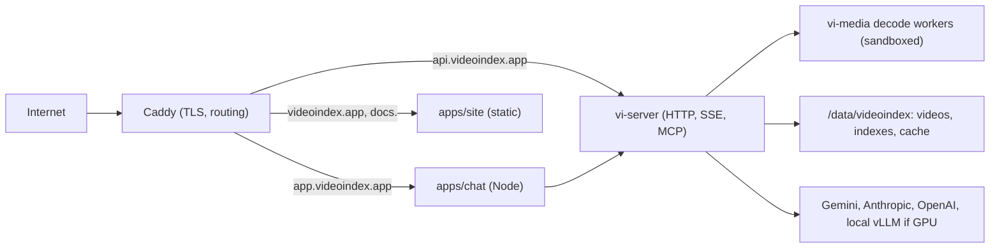

# 11. Deployment: videoindex.app on azuremc

`azuremc` is a cloud machine (Azure) that hosts the videoindex.app domain. It runs the infrastructure, the demo QnA chat app over the dataset videos, and the SDK site. Development happens on it directly with this repository.

## What runs where



| Component | Host | Process | Port |
|---|---|---|---|
| Reverse proxy | azuremc | Caddy, automatic Let's Encrypt | 80, 443 |
| API + MCP | azuremc | `vi serve`, systemd | 127.0.0.1:8080 |
| Chat app | azuremc | Node, systemd | 127.0.0.1:3000 |
| SDK site | azuremc | static files served by Caddy | — |
| vLLM (optional, if GPU) | azuremc | container | 127.0.0.1:8000 |
| Whisper server (optional) | azuremc | container | 127.0.0.1:9000 |

Caddy is chosen for automatic TLS with no cron; nginx with certbot is an acceptable substitute if it is already present on the machine.

## Subdomains

- `videoindex.app`, `www.` : SDK landing and docs (later a Node.js frontend; static to start).
- `app.videoindex.app`: demo QnA chat app.
- `api.videoindex.app`: `vi-server`, including `/v1/mcp`.

## Disk layout

```
/data/videoindex/
  videos/            content-addressed media cache (downloads from yt-dlp or transfers from the Mac)
  indexes/
    dataset.vidx/    the demo index over dataset/videolist.md
    eval-lvbench.vidx/
  cache/             operator cache shared across indexes (optional; else inside each index)
  logs/
/etc/videoindex/
  videoindex.toml    providers, roles, policies, storage, server
  env                API keys, mode 0600, loaded by systemd EnvironmentFile
```

Sizing: LVBench alone is about 117 hours of video, roughly 100 to 150 GB at 720p, plus 5 to 10 GB of index. The dataset playlists are tens of hours. Plan for at least 500 GB on the data volume.

## systemd units

- `videoindex-api.service`: `vi serve --config /etc/videoindex/videoindex.toml --bind 127.0.0.1:8080 --mcp`, `Restart=always`, `EnvironmentFile=/etc/videoindex/env`, runs as user `videoindex`, `ProtectSystem=strict`, `ReadWritePaths=/data/videoindex`, `MemoryMax` set to leave headroom for decode workers.
- `videoindex-chat.service`: the Node chat app with `VI_API_URL=http://127.0.0.1:8080`.
- Decode workers are children of `vi serve`; the service unit's limits bound them. Seccomp for the worker is applied by `vi-media` itself.

## Secrets

Provider keys live only in `/etc/videoindex/env`. The chat app holds no provider keys; it talks to `vi-server` with a server-side API key. Public demo traffic gets a rate-limited key with a per-day cost cap enforced by `vi-server` quotas so a burst of visitors cannot run up provider bills.

## GPU detection

`vi doctor` and `vi serve` at startup report CPU count, RAM, GPU (via `nvidia-smi` when present), hardware decoders, ONNX execution providers, ffmpeg version, and yt-dlp presence. Configuration decides the rest:

- **GPU present**: run whisper-large under a local server for ASR, SigLIP embeddings on CUDA, optionally an open VLM under vLLM for A/B against frontier APIs.
- **No GPU**: ASR via a hosted Whisper-compatible endpoint or Gemini audio; embeddings on CPU (fine at 1 fps); all VLM and LLM calls remote.

## Getting videos onto azuremc

YouTube blocks most downloads from datacenter IPs, so `vi acquire` with yt-dlp is not expected to work on azuremc. The working path is:

1. On the development Mac, run `scripts/download_videos.sh` (defaults to the playlists in `dataset/videolist.md`; pass a file of URLs for benchmark sets). It downloads 720p MP4 plus subtitles and `.info.json` into `dataset/videos/`.
2. Transfer with `rsync -avP --partial dataset/videos/ azuremc:/data/videoindex/videos/incoming/`. The script prints the exact command. Resumable, so it can run overnight.
3. On azuremc, `vi index ./dataset.vidx /data/videoindex/videos/incoming/**/*.mp4`. The `LocalFile` acquirer reads the sidecar `.info.json` and subtitle files for title, chapters, and captions, then moves the media into the content-addressed cache.

`vi acquire` on azuremc remains useful for direct HTTP and object-storage sources.

## Observability

- `vi-server` exposes `/metrics` for Prometheus: request latency, tool-call counts, provider tokens and cost, decode time, cache hit rate, job states.
- Structured JSON logs to journald; keys redacted.
- Cost dashboard from the Provenance table: cost per video, per configuration, per day.

## Backups

Indexes are directories. A nightly `tar` of `/data/videoindex/indexes` to Azure Blob Storage, retained 14 days, is enough at this stage. Media is re-downloadable and is not backed up.

## Rollout

1. Provision `/data/videoindex`, user `videoindex`, Caddy, systemd units, DNS records for the three hostnames.
2. Build `vi` from this repo on azuremc; `vi doctor`.
3. Acquire and index the dataset playlists into `dataset.vidx`.
4. Start `vi serve`; smoke test `search` and `ask` with curl.
5. Deploy the chat app; verify citations seek the player.
6. Point `videoindex.app` at the static site.
