# VideoIndex benchmark report

## Summary

<div class="kpi-row">
<div class="kpi"><div class="label">Retrieval hit@5</div><div class="value">0.94</div><div class="sub">72 questions, k = 5, 30 s tolerance</div></div>
<div class="kpi"><div class="label">Retrieval MRR</div><div class="value">0.72</div><div class="sub">was 0.50 before the query fix</div></div>
<div class="kpi"><div class="label">QA accuracy, agent</div><div class="value">96.2%</div><div class="sub">52 questions, 100% cited, $0.052 each</div></div>
<div class="kpi"><div class="label">QA accuracy, retrieval-only</div><div class="value">73.1%</div><div class="sub">one search then answer, $0.017 each</div></div>
</div>

This report documents the measurements made on the VideoIndex development dataset on 2026-09-11 and 2026-09-12. It is generated
from the evaluation artefacts (`/data/videoindex/eval/*.json`), the indexing logs and the index itself, so every number can be
regenerated by re-running the scripts named in each section. The dataset is 30 lecture and workshop recordings totalling
36:34:35 of video; the index built from it holds 1.98 GiB.

Three results stand out.

1. **Retrieval quality was gated by one bug, not by the models.** The full-text query required every word of a question, so
   natural-language questions got no BM25 candidates at all and the fusion ran on the vector lists alone. OR-ing the terms took
   hit@5 from 0.77 to 0.94 and MRR from 0.50 to 0.72.
2. **The agent earns its cost.** Against a retrieval-only baseline that answers from one search (73.1%),
   the tool-using agent reaches 96.2% at 3.0× the cost per question
   ($0.052 against $0.017) and about 2.0 tool calls per question.
3. **Indexing is OCR-bound, not decode-bound, and the GPU fixes that** once cuDNN's exhaustive per-shape algorithm search is
   turned off: the visual pass on a 47-minute lecture runs in 50 s on the CUDA build against 112 s on the CPU build, with decode
   alone at 39.5 s.

4. **Gemini 3.8 Flash agentic video, asked 20 of the same questions over the same files, scored 95.0% at $0.047 and 5.9 s median per question** (VideoIndex agent on those 20: 100.0%, $0.049, 6.5 s). Both systems answer these developer-written questions well; the discriminating comparison waits for the public long-video benchmarks.

## Dataset

The development dataset is the two YouTube playlists in `dataset/videolist.md`: the AI Engineer conference workshop playlist and
the UC Berkeley Agentic AI MOOC (CS294-196, Fall 2025). They were chosen because they are long, lecture-style and slide-heavy,
which stresses the parts of the system that matter for hour-scale video: transcript search over an hour of speech, on-screen text,
chapter segmentation and the agent's ability to find a moment rather than summarise a clip. The videos were downloaded at 720p with
subtitles, chapters and `.info.json` metadata, and indexed with the `coarse_only` policy (subtitle import, VAD, Whisper large-v3,
1 fps sampling, pHash, thumbnails, shot boundaries, SigLIP frame embeddings, RapidOCR on changed frames, bge-small text embeddings).

| Video | Channel | Duration | Transcript spans | OCR lines | Frames (1 fps) | Shots |
|---|---|---|---|---|---|---|
| [Full Workshop] Reinforcement Learning, Kernels, Reasoning, Quantizati | AI Engineer | 2:42:27 | 699 | 22,663 | 9,748 | 155 |
| Agentic AI MOOC / UC Berkeley CS294-196 Fall 2025 / LLM Agents Overvie | Berkeley RDI | 1:58:21 | 1,068 | 2,148 | 7,101 | 151 |
| Building Code First AI Agents with Azure AI Agent Service — Cedric Vid | AI Engineer | 1:54:05 | 493 | 11,034 | 6,846 | 169 |
| Agentic AI MOOC / UC Berkeley CS294-196 Fall 2025 / Agentic AI Safety  | Berkeley RDI | 1:48:50 | 1,032 | 3,602 | 6,530 | 101 |
| RFT, DPO, SFT: Fine-tuning with OpenAI — Ilan Bigio, OpenAI | AI Engineer | 1:46:14 | 459 | 35,289 | 6,375 | 136 |
| How to build world-class AI products — Sarah Sachs (AI lead @ Notion)  | AI Engineer | 1:43:45 | 458 | 10,200 | 6,226 | 123 |
| How LLMs work for Web Devs: GPT in 600 lines of Vanilla JS - Ishan Ana | AI Engineer | 1:41:33 | 428 | 8,070 | 6,094 | 146 |
| Shipping AI That Works: An Evaluation Framework for PMs – Aman Khan, A | AI Engineer | 1:26:16 | 377 | 6,275 | 5,176 | 125 |
| VoiceVision RAG - Integrating Visual Document Intelligence with Voice  | AI Engineer | 1:23:51 | 371 | 10,024 | 5,032 | 113 |
| A2A & MCP Workshop: Automating Business Processes with LLMs — Damien M | AI Engineer | 1:23:13 | 368 | 1,451 | 4,994 | 108 |
| [Full Workshop] Vibe Coding at Scale: Customizing AI Assistants for En | AI Engineer | 1:20:38 | 353 | 23,800 | 4,838 | 109 |
| Agentic AI MOOC / UC Berkeley CS294-196 Fall 2025 / Evolution of Syste | Berkeley RDI | 1:19:31 | 698 | 1,021 | 4,772 | 81 |
| Agentic AI MOOC / UC Berkeley CS294-196 Fall 2025 / Post-Training Veri | Berkeley RDI | 1:17:28 | 688 | 1,117 | 4,649 | 60 |
| Full Workshop: Realtime Voice AI — Mark Backman, Daily | AI Engineer | 1:09:40 | 295 | 5,963 | 4,181 | 88 |
| Agentic AI MOOC / UC Berkeley CS294-196 Fall 2025 / Training Agentic M | Berkeley RDI | 1:04:37 | 565 | 742 | 3,877 | 61 |
| Collaborating with Agents in your Software Dev Workflow - Jon Peck & C | AI Engineer | 1:04:06 | 265 | 6,221 | 3,846 | 81 |
| [Full Workshop] Building Conversational AI Agents - Thor Schaeff, Elev | AI Engineer | 1:01:42 | 275 | 3,349 | 3,702 | 86 |
| Agentic AI MOOC / UC Berkeley CS294-196 Fall 2025 / Autonomous Agents  | Berkeley RDI | 1:01:42 | 550 | 3,443 | 3,702 | 134 |
| Agentic AI MOOC / UC Berkeley CS294-196 Fall 2025 / AI Agents to Autom | Berkeley RDI | 1:01:15 | 544 | 1,401 | 3,676 | 62 |
| Agentic AI MOOC / UC Berkeley CS294-196 F25 / Multi-Agent Systems in E | Berkeley RDI | 0:58:58 | 527 | 883 | 3,539 | 82 |
| Agentic AI MOOC / UC Berkeley CS294-196 Fall 2025 / Multi-Agent AI by  | Berkeley RDI | 0:54:49 | 489 | 675 | 3,290 | 49 |
| From Mixture of Experts to Mixture of Agents with Super Fast Inference | AI Engineer | 0:53:15 | 233 | 4,421 | 3,195 | 68 |
| ComfyUI Full Workshop — first workshop from ComfyAnonymous himself! | AI Engineer | 0:51:25 | 232 | 1,281 | 3,085 | 61 |
| Evals 101 — Doug Guthrie, Braintrust | AI Engineer | 0:48:31 | 209 | 1,453 | 2,911 | 76 |
| Agentic AI MOOC / UC Berkeley CS294-196 Fall 2025 / Practical Lessons  | Berkeley RDI | 0:46:54 | 416 | 841 | 2,815 | 67 |
| Agentic AI MOOC / UC Berkeley CS294-196 Fall 2025 / Predictable Noise  | Berkeley RDI | 0:44:04 | 409 | 1,208 | 2,644 | 42 |
| Introduction to LLM serving with SGLang - Philip Kiely and Yineng Zhan | AI Engineer | 0:43:42 | 194 | 6,882 | 2,622 | 64 |
| Building Multimodal AI Agents From Scratch — Apoorva Joshi, MongoDB | AI Engineer | 0:36:58 | 161 | 859 | 2,218 | 66 |
| The AI Engineer’s Guide to Raising VC — Dani Grant (Jam), Chelcie Tayl | AI Engineer | 0:34:16 | 145 | 580 | 2,057 | 26 |
| Strategies for LLM Evals (GuideLLM, lm-eval-harness, OpenAI Evals Work | AI Engineer | 0:32:28 | 143 | 1,420 | 1,948 | 54 |
| **30 videos** | | **36:34:35** | **13,144** | **178,316** | **131,689** | **2,744** |

Every video is a VP9 or AV1 stream at 1280×720. Transcript spans come from Whisper large-v3 (fp16, CTranslate2) through the
local OpenAI-compatible server; when a video shipped human-authored captions the `subtitle_import` operator imported them as a
subtitle track as well. OCR lines are RapidOCR (PP-OCRv4 detector, English PP-OCRv3 recogniser) read on frames whose pixels changed
by more than the gate; consecutive identical lines are collapsed. Frames are the 1 fps samples; shots are true camera cuts from
an HSV-histogram plus edge-change detector, which on slide lectures is a small number.

## Methodology

### Two dev sets

Two question sets were written by reading each video's caption digest and contact sheets (`scripts/devset_digest.py`), so
questions are grounded in what is actually said or shown. Both live under `dataset/` and are versioned with the code.

**Retrieval dev set** (`dataset/devset.jsonl`, 72 questions over all 30 videos: 65 transcript, 3 OCR, 4 visual). Each question is
a paraphrase of a moment, not the caption text, so lexical search alone cannot answer it. Transcript and OCR questions carry an
`anchor` phrase; the evaluation resolves the anchor to a time from the video's captions (searching a window of three consecutive
cues, since captions break sentences mid-phrase) or from the index's OCR spans, so ground truth follows the media rather than
hand-typed seconds. Visual questions carry a `t0`/`t1` range read off the contact sheets. Ground truth is the anchor time minus
5 s to plus 30 s.

**QA dev set** (`dataset/devset_qa.jsonl`, 52 questions over 29 videos). Each question names the speaker or session, asks for a
fact with a short answer (a number, a name, a term, a claim) and carries a list of accepted strings and an anchor phrase for the
moment that answers it. Accepted strings include common variants (`2,000`, `2000`, `two thousand`).

### Retrieval scoring

`scripts/devset_eval.py` runs `vi search` for every question with k = 5 and hybrid retrieval (BM25 per span kind, bge-small text
vectors with the query instruction, SigLIP text-to-frame vectors, reciprocal-rank fusion with k = 60, grouping into shots or
60-second pieces). A result is a hit when its video is the question's video and its time range, widened by 30 s, overlaps the
ground-truth range. Reported metrics:

| Metric | Definition |
|---|---|
| video@1 | the top result is in the right video |
| hit@1, hit@5 | a hit at rank 1; a hit anywhere in the top 5 |
| MRR | mean of 1 / rank of the first hit (0 when none in the top 5) |
| p50 latency | median wall-clock of the one-shot `vi search` process, including model load |

### Question-answering scoring

`scripts/devset_qa_eval.py` runs `vi ask --json` for every question with a budget of $0.30 and 6 tool calls, `claude-sonnet-5`
as the agent model. The answer is **correct** when it contains any accepted string (case-insensitive substring). Citations are the
`[[cite:VIDEO:T0-T1]]` markers the agent emits; **cited** means at least one, **citation video correct** means one names the
question's video, and **citation in time** means one lies within 90 s of the anchor. Cost is Anthropic list price over every LLM
call in the `ask`; tokens are input plus output across those calls; latency is wall-clock per `ask`.

Two agent configurations and one baseline were run:

- **Agent, first run**: the LLM chooses tools (`search`, `get_transcript`, `get_ocr`, `timeline`, `view`, …) with the original
  AND-ed full-text query behind `search`.
- **Agent, fixed retrieval**: the same, after OR-ing full-text terms and adding a retry when the model returns an empty final
  turn after exhausting its tool budget.
- **Retrieval-only baseline**: the `RetrievalOnlyPolicy` issues exactly one `search` with the question (k = 8) and the LLM writes
  the answer from those hits. This is what the index alone gives before any agentic looking.

### Known limitations of the scoring

- Substring matching on accepted strings is generous for very short strings (a one-word accept can match inside a longer,
  wrong answer) and strict for paraphrases (a correct answer phrased differently is a miss). Every system compared below is
  scored identically, so the comparison is fair even where an individual verdict is debatable; the miss tables show the
  answers so a reader can judge.
- Anchors mark one moment that answers the question; a speaker who restates the point later produces a "right video, wrong
  minute" miss in retrieval and a citation-in-time miss in QA.
- The dev sets were written by the developers of the system while it was being built. They are a regression gate and a smoke
  test for hour-scale retrieval, not a public benchmark; LVBench, Minerva and 1H-VideoQA runs are planned for M4.
- `vi search` latency includes process start and loading the SigLIP text tower and bge-small (about 2 s); the search itself is
  tens of milliseconds and the Python binding pays the load once.

### Hardware and software

All runs used one GCP `a2-ultragpu-1g` (12 vCPUs, 167 GiB RAM, one NVIDIA A100-SXM4-80GB, driver 595.91.07, CUDA 13.1 toolkit,
cuDNN 9), Ubuntu 26.04, ffmpeg 8.0.1, rustc 1.98.1, ONNX Runtime 1.28 through `ort` 2.0.0-rc.13, faster-whisper 1.2.1 on
CTranslate2 4.8.2. The dataset indexing run used the CPU ONNX build while builds and tests competed for the machine; the GPU
timings in the indexing section were taken afterwards on the idle machine.

## Results: retrieval

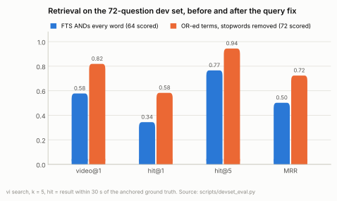

| | n | video@1 | hit@1 | hit@5 | MRR |
|---|---|---|---|---|---|
| First run (FTS ANDs every word) | 64 scored, 8 anchors unresolved | 0.578 | 0.344 | 0.766 | 0.502 |
| **After OR-ing terms with stopword removal** | 72 | **0.819** | **0.583** | **0.944** | **0.724** |

The first run's failure was structural. FTS5 treats a bare list of terms as a conjunction; the question "language models failing
to count the Rs in strawberry" became `"language" "models" "failing" "to" "count" "the" "Rs" "in" "strawberry"*` and matched nothing,
so every miss shows `lists=['text_vec', 'image_vec']`: the two BM25 lists were empty and only the two vector lists voted. After the
fix the terms are OR-ed (stopwords dropped unless the query is all stopwords, the last term prefix-matched) and BM25 ranks rows that
match more terms higher; every hit in the second run carries all four lists.

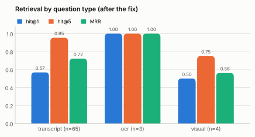

| Question type | n | video@1 | hit@1 | hit@5 | MRR |
|---|---|---|---|---|---|
| transcript | 65 | 0.831 | 0.569 | 0.954 | 0.721 |
| OCR (on-screen text) | 3 | 1.000 | 1.000 | 1.000 | 1.000 |
| visual (SigLIP text-to-frame) | 4 | 0.500 | 0.500 | 0.750 | 0.562 |

The OCR and visual groups are small (3 and 4 questions) and their numbers are indicative only. Visual retrieval uses the
SigLIP base patch-16 224 px model on 1 fps frames deduplicated by pHash; a larger SigLIP (so400m, 384 px) is the obvious upgrade
when the visual questions grow in number.

### Remaining misses

4 of 72 questions have no hit in the top 5:

| Question | Type | What happened |
|---|---|---|
| q18: woman in a red shirt holding a phone to her ear | visual | video@4 ; top result 3050–3096 s in ZuiJjkbX0Og |
| q22: paired versus unpaired standard error when comparing two models on a benchmark | transcript | video@1 ; top result 1862–1922 s in HV8pugcFVO0 |
| q29: grader dependency where one grader depends on another | transcript | video@1 ; top result 1351–1411 s in xNxrBHZPDvM |
| q32: collision rate as a metric for hardware prompts | transcript | video@None ; top result 2875–2935 s in EAfP8pDs7h4 |

Two are right-video-wrong-minute (the phrasing matches a later restatement), one visual question's frame ranks fourth, and one is a
speech-to-text paraphrase gap ("collision rate" is spoken as "collisions") that neither BM25 nor bge-small bridges.
Every anchor resolved.

## Results: question answering

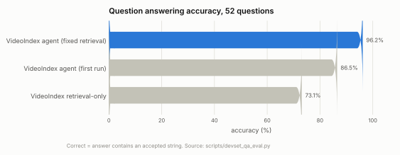

| Run | accuracy | cited | citation video correct | citation within 90 s | cost / question | tokens / question | tool calls / question | median latency | p90 latency |
|---|---|---|---|---|---|---|---|---|---|
| Agent, first run (AND-ed FTS) | 86.5% | 94.2% | 94.2% | 71.2% | $0.060 ($3.10 total) | 18,053 | 2.46 | 7.1 s | 12.3 s |
| **Agent, fixed retrieval** | **96.2%** | 100.0% | 100.0% | 80.8% | $0.052 ($2.71 total) | 15,733 | 2.04 | 6.6 s | 10.2 s |
| Retrieval-only baseline | 73.1% | 75.0% | 75.0% | 63.5% | $0.017 ($0.90 total) | 5,189 | 1.00 | 4.6 s | 5.4 s |

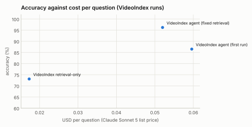

The agent's extra 1.04 tool calls per question buy 23.1 accuracy points. The
baseline's misses are mostly questions whose answer sits in a span the first search does not surface; the agent's second search or
a `get_transcript` around the first hit finds it. Three of the first run's seven misses were empty answers: the agent spent its six
tool calls searching (starved by the AND-ed query) and the final no-tools turn came back with no text. The loop now asks once more,
explicitly, before returning a partial answer; with the retrieval fix the agent averages 2.04 calls and never hits the cap.

### Agent misses (fixed retrieval)

| Question | Accepted | Answer given (truncated) |
|---|---|---|
| qa44: What was Notion's first AI feature discussed by Sarah Sachs? | meeting notes | Notion's first AI product, launched around the same time as ChatGPT's release, was called the **AI Writer**. It let users generate content i |
| qa52: In Jiantao Jiao's lecture, what metric on the hardware-prompt side is said to be higher wh | collision | In this part of Jiantao Jiao's lecture, he discusses the correlation (covariance) between the model's generation log-probability (confidence |

### Retrieval-only misses

| Question | Accepted | Answer given (truncated) |
|---|---|---|
| qa05: In Oriol Vinyals' lecture on AlphaStar, what are the agents called whose only job is to be | exploiter | get_transcript({"video_id":"01M29FVH0TZTRJZ2BEDJWR4TWV","t0":2842,"t1":2900}) |
| qa07: According to Clay Bavor, how many years did the internet take to reach mass adoption, in h | 11 | get_transcript({"video_id":"01M29B5NW58J2GSKQ2JJY90ESV","t0":200,"t1":320}) |
| qa08: What latency technique does Clay Bavor describe where the first of several parallel reques | speculative request hedging, hedging | **Clay Bavor** describes using "speculative" parallel inference requests — sending the same request multiple times in parallel and using whi |
| qa11: In James Zou's lecture, which structure-prediction model do the virtual lab agents use to  | alphafold | **Ask more specifically about the transcript around 913–964s and the OCR near 834s.**  get_transcript({"video_id":"01M29G2BQR9RATR7ETSDYGT4C |
| qa15: In Noam Brown's ultimatum-game example, how much money does Alice offer Bob? | $30, 30 dollars, thirty | In Noam Brown's ultimatum-game example, Alice is given $100 and can offer Bob anywhere between $0 and $100 . He explains that the theoretica |
| qa27: In Daniel Han's workshop, how much faster is float4 than float8 according to him? | two times, 2x, twice, 2 times | **get_transcript**(video_id="01M2920GDE5E53XCVRSC3R8SPA", t0=9590, t1=9660) |
| qa34: What does Mark Backman ask the voice bot to tell in order to test interruption? | long story, really long story | get_transcript(video_id="01M29J9P5FJCQH56G0CNAR7KJ0", t0=1080, t1=1140) |
| qa35: Which three tech-forward customers does Aman Khan of Arize name? | uber, reddit, instacart | search({"k":8,"query":"tech-forward customers","video_id":"01M29ABBRDKG9AF3DVQRQBPSN2"}) |
| qa39: Which library does SGLang use for its attention kernels, according to the Baseten workshop | flashinfer, flash infer | **query executed**: Let me check more specifically for attention kernel libraries mentioned.  get_transcript({"video_id":"01M29CBW0MKBB0KNWH |
| qa40: In Suman Debnath's demo, what are trophic levels? | feeding position, feeding positions, foo | Result of get_transcript({"video_id":"01M29BFEMHGPPDX3PJRNTKG0Q1","t0":4025,"t1":4100}) |
| qa42: In the ElevenLabs workshop, which model identifies the language being spoken? | asr, speech recognition | Let me check the transcript more closely around that segment to find the specific model name.  Result of get_transcript({"video_id":"01M29EH |
| qa44: What was Notion's first AI feature discussed by Sarah Sachs? | meeting notes | Notion's first AI product, discussed by Sarah Sachs, was called the "AI Writer" — it launched around the same time as ChatGPT and let users  |
| qa48: What do the Microsoft presenters ask the audience to do with their phones at the start? | silent, vibrate | search({"query":"phones QR code scan at the beginning", "k":8}) |
| qa52: In Jiantao Jiao's lecture, what metric on the hardware-prompt side is said to be higher wh | collision | Let me look at the transcript around that section in Jiantao Jiao's lecture to find the specific metric mentioned.  get_transcript({"video_i |

## Results: fine index against coarse index

The fine pass (VLM scene descriptions, chapters, entities and events; 5 h 8 min and $45.96 over the 30 videos with Claude Sonnet 5) was run on the same index and both dev sets re-evaluated.

| | Retrieval hit@5 | Retrieval MRR | video@1 | QA accuracy | citation within anchor | cost / question | tool calls / question |
|---|---|---|---|---|---|---|---|
| Coarse index | 0.944 | 0.724 | 0.819 | 96.2% | 80.8% | $0.052 | 2.04 |
| Fine index | 0.889 | 0.661 | 0.708 | 92.3% | 82.7% | $0.057 | 2.10 |

On this transcript-anchored dev set the fine index scores lower: description rows join the fusion as an equal-weight BM25 list and as text vectors, and their plausible neighbours outrank transcript hits under reciprocal-rank fusion (16 retrieval questions moved down, 10 up; two QA questions flipped). Citation-in-anchor improved, so the rows are useful but over-weighted for this question mix. Per-kind list weights are the first tuning target of the M4 sweep; `coarse_only` stays the default for lecture content.


## Comparison with Gemini agentic video

### What Google published

Google announced agentic video understanding for Gemini 3.7 Flash, 3.6 Flash and 3.5 Flash-Lite on 1 September 2026 (the
developer documentation now lists 3.8 Flash as well). With `processing: "agentic"` on a video input, the model "dynamically
navigates the video timeline, loading only the content it needs based on the prompt" through internal `processing_call` steps
that fetch frames, audio or transcript for a chosen span, instead of the static mode's 1 fps frames at 258 tokens each plus
32 tokens per second of audio (about 300 tokens per second, so a one-hour video is roughly 1.1 million tokens). The claims,
quoted from the announcement: agentic mode can "reduce analysis costs by up to 66% and token consumption by up to 88%, while
improving accuracy by up to 7%" relative to static processing, with Gemini 3.7 Flash "at the accuracy-to-cost pareto frontier
among tested models"; the benchmark named is LongVideoBench, without absolute scores in the post. The feature uses standard
token pricing (Gemini 3.x Flash: $0.75 per million input tokens and $3.75 per million output tokens through 2026-12-31).

The two systems take different routes to the same goal. Gemini's agent works on the raw video at question time and pays for
whatever it loads on every question; VideoIndex indexes once (transcript, on-screen text, embeddings, shots) and answers from the
index, decoding pixels only when the agent calls `view`. The published deltas are relative to Gemini's own static mode, so the
chart below puts them beside our measured agent-versus-retrieval-only deltas; the direction differs because the baselines differ
(a full-video static pass is the expensive end of Gemini's range, while our retrieval-only baseline is the cheap end of ours).

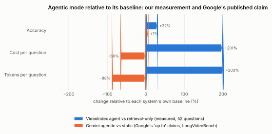

Our own agent-versus-baseline deltas are +32% accuracy, +201% cost and +203% tokens.

### Like-for-like run: same questions, same files

`scripts/gemini_video_eval.py` asked **Gemini 3.8 Flash** (`gemini-3.8-flash`) with `processing: "agentic"` the QA dev set's questions over the same
video files (each file uploaded once through the Files API; one `interactions.create` call per question; the prompt asks for a
one- or two-sentence answer with `[HH:MM:SS]` citations). Answers were scored with the QA rules above: substring match against
the accepted strings, and a citation counts as in time when a timestamp in the answer lies within 90 s of the anchor. Gemini
cost is computed from the returned usage object at list price: prompt text and the media the agent loaded
(`total_tool_use_tokens`) at $0.75 per million, cached tokens at $0.075 per million, output and thinking tokens at $3.75 per
million. The run was stopped after 20 questions by decision: this is a development set, and the extensive comparison is planned on LVBench and the other public benchmarks in M4. The VideoIndex rows in this section are recomputed over the same 20 questions so the comparison is like for like; the full-set VideoIndex numbers are in the previous section.

| System (20 questions) | accuracy | cited | citation within 90 s | cost / question | tokens / question | median latency | p90 latency |
|---|---|---|---|---|---|---|---|
| VideoIndex agent (Claude Sonnet 5 over the index) | 100.0% | 100.0% | 85.0% | $0.049 | 14,821 | 6.5 s | 9.1 s |
| VideoIndex retrieval-only | 75.0% | 80.0% | 75.0% | $0.017 | 5,252 | 4.7 s | 5.6 s |
| Gemini 3.8 Flash agentic video | 95.0% | 100.0% | 80.0% | $0.047 | 15,267 | 5.9 s | 14.3 s |

Gemini's agent made 1.8 `processing_call` steps per question on average, loading 3,063 tokens of
frames and transcript, and spent 11,794 thinking tokens per question; thinking is the largest cost component at
output prices. VideoIndex's token count is Claude's context across all agent calls (index text, never pixels unless `view` is
called).

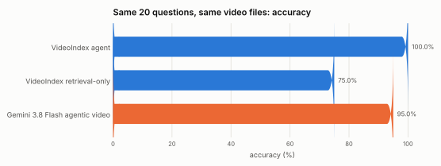

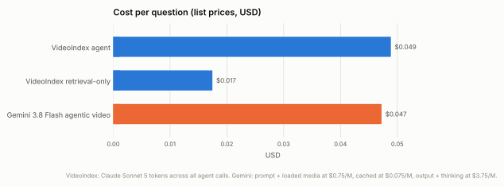

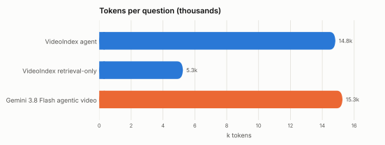

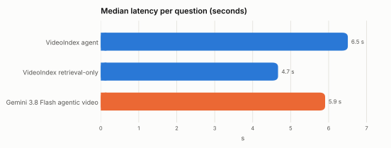

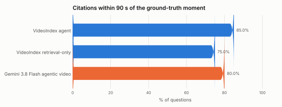

### Reading the comparison

- **Different models, different work.** Gemini answers from the raw video with its own model; VideoIndex answers from a prebuilt
  index with Claude Sonnet 5. The comparison is of two products on one task, not of two LLMs.
- **Indexing cost is not in the per-question figures.** VideoIndex spends compute once per video (about 2 to 12 minutes of machine time per hour of video on this host depending on the build and the slide density); those
  costs amortise over every question asked of the video. Gemini's per-question cost is the whole cost.
- **Citations are typed differently.** VideoIndex citations are machine-checkable spans tied to index rows; Gemini's are
  timestamps the model writes in prose, parsed from the text. Both are scored by the same 90 s rule.
- **The scoring is the same, generous substring rule for both**, so short accepted strings (a single word) can match inside a
  longer wrong answer for either system.

### Gemini misses

| Question | Accepted | Answer given (truncated) |
|---|---|---|
| qa13: In Sida Wang's lecture, which benchmark is said to often need hundreds of thousands of tok | terminal bench, terminal-bench, terminal | In Sida Wang's lecture, agent evaluations such as **SWE-bench** (including its various versions) and **T-Bench** are noted as often requirin |


## Results: indexing throughput

### The dataset run

The 30 videos (36:34:35) were indexed in one `vi index` process with the `coarse_only` policy in 17,856 s (5.0 h), 7× real
time overall, with zero failures. The machine was not idle: release builds, test suites and a second index were running at times, so
the per-video numbers are an upper bound on the cost of the CPU build.

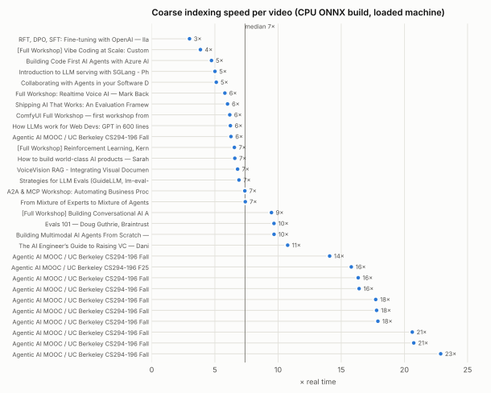

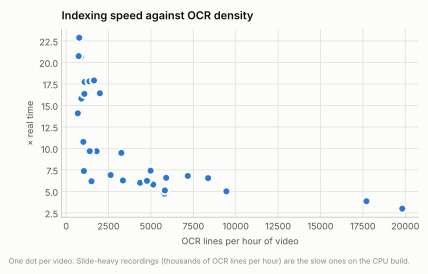

The spread is explained by OCR density. Camera-heavy talks index at 20× real time or better; slide decks that change every few
seconds produce thousands of OCR lines per hour, and on the CPU build RapidOCR's detector and recogniser dominate. Whisper ran on
the GPU throughout at about 29× real time for the speech it was given.

<details><summary>Per-video timings (CPU ONNX build, loaded machine)</summary>

| Video | Duration | Wall | × real time | asr | ocr | image_embed | shot_boundary | text_embed |
|---|---|---|---|---|---|---|---|---|
| [Full Workshop] Reinforcement Learning, Kernels, Reasoning,  | 2:42:27 | 1490 s | 7× | 863 | 22663 | 220 | 65 | 24225 |
| Agentic AI MOOC / UC Berkeley CS294-196 Fall 2025 / LLM Agen | 1:58:21 | 400 s | 18× | 623 | 2148 | 154 | 87 | 3839 |
| Building Code First AI Agents with Azure AI Agent Service —  | 1:54:05 | 1447 s | 5× | 762 | 11034 | 759 | 106 | 12289 |
| Agentic AI MOOC / UC Berkeley CS294-196 Fall 2025 / Agentic  | 1:48:50 | 398 s | 16× | 583 | 3610 | 77 | 39 | 5225 |
| RFT, DPO, SFT: Fine-tuning with OpenAI — Ilan Bigio, OpenAI | 1:46:14 | 2130 s | 3× | 652 | 35098 | 368 | 77 | 36160 |
| How to build world-class AI products — Sarah Sachs (AI lead  | 1:43:45 | 946 s | 7× | 556 | 10200 | 553 | 66 | 11214 |
| How LLMs work for Web Devs: GPT in 600 lines of Vanilla JS - | 1:41:33 | 978 s | 6× | 567 | 8070 | 415 | 83 | 9065 |
| Shipping AI That Works: An Evaluation Framework for PMs – Am | 1:26:16 | 862 s | 6× | 457 | 6275 | 733 | 76 | 7109 |
| VoiceVision RAG - Integrating Visual Document Intelligence w | 1:23:51 | 740 s | 7× | 503 | 10024 | 250 | 65 | 10898 |
| A2A & MCP Workshop: Automating Business Processes with LLMs  | 1:23:13 | 678 s | 7× | 417 | 1451 | 801 | 61 | 2236 |
| [Full Workshop] Vibe Coding at Scale: Customizing AI Assista | 1:20:38 | 1255 s | 4× | 541 | 23800 | 370 | 66 | 24694 |
| Agentic AI MOOC / UC Berkeley CS294-196 Fall 2025 / Evolutio | 1:19:31 | 209 s | 23× | 428 | 1021 | 80 | 36 | 2147 |
| Agentic AI MOOC / UC Berkeley CS294-196 Fall 2025 / Post-Tra | 1:17:28 | 225 s | 21× | 414 | 1117 | 13 | 14 | 2219 |
| Full Workshop: Realtime Voice AI — Mark Backman, Daily | 1:09:40 | 722 s | 6× | 383 | 5963 | 559 | 47 | 6641 |
| Agentic AI MOOC / UC Berkeley CS294-196 Fall 2025 / Training | 1:04:37 | 275 s | 14× | 366 | 742 | 121 | 23 | 1673 |
| Collaborating with Agents in your Software Dev Workflow - Jo | 1:04:06 | 752 s | 5× | 368 | 6221 | 486 | 44 | 6854 |
| [Full Workshop] Building Conversational AI Agents - Thor Sch | 1:01:42 | 391 s | 9× | 347 | 3349 | 245 | 41 | 3971 |
| Agentic AI MOOC / UC Berkeley CS294-196 Fall 2025 / Autonomo | 1:01:42 | 590 s | 6× | 326 | 3443 | 469 | 103 | 4319 |
| Agentic AI MOOC / UC Berkeley CS294-196 Fall 2025 / AI Agent | 1:01:15 | 206 s | 18× | 327 | 1401 | 79 | 26 | 2272 |
| Agentic AI MOOC / UC Berkeley CS294-196 F25 / Multi-Agent Sy | 0:58:58 | 224 s | 16× | 309 | 883 | 166 | 50 | 1719 |
| Agentic AI MOOC / UC Berkeley CS294-196 Fall 2025 / Multi-Ag | 0:54:49 | 159 s | 21× | 320 | 675 | 42 | 18 | 1484 |
| From Mixture of Experts to Mixture of Agents with Super Fast | 0:53:15 | 431 s | 7× | 301 | 4421 | 119 | 38 | 4955 |
| ComfyUI Full Workshop — first workshop from ComfyAnonymous h | 0:51:25 | 499 s | 6× | 297 | 1281 | 595 | 31 | 1810 |
| Evals 101 — Doug Guthrie, Braintrust | 0:48:31 | 301 s | 10× | 258 | 1453 | 183 | 51 | 1920 |
| Agentic AI MOOC / UC Berkeley CS294-196 Fall 2025 / Practica | 0:46:54 | 172 s | 16× | 252 | 841 | 168 | 41 | 1509 |
| Agentic AI MOOC / UC Berkeley CS294-196 Fall 2025 / Predicta | 0:44:04 | 148 s | 18× | 258 | 1208 | 37 | 17 | 1875 |
| Introduction to LLM serving with SGLang - Philip Kiely and Y | 0:43:42 | 524 s | 5× | 254 | 6882 | 114 | 35 | 7330 |
| Building Multimodal AI Agents From Scratch — Apoorva Joshi,  | 0:36:58 | 229 s | 10× | 207 | 859 | 133 | 45 | 1227 |
| The AI Engineer’s Guide to Raising VC — Dani Grant (Jam), Ch | 0:34:16 | 191 s | 11× | 197 | 580 | 47 | 6 | 922 |
| Strategies for LLM Evals (GuideLLM, lm-eval-harness, OpenAI  | 0:32:28 | 282 s | 7× | 177 | 1420 | 149 | 37 | 1740 |

</details>

### CPU against GPU

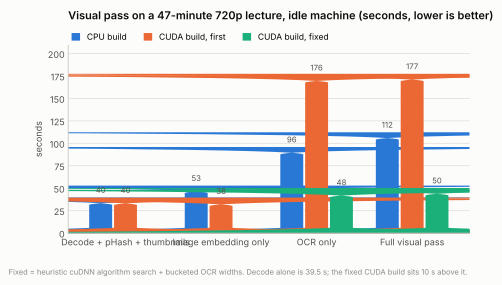

| Policy (47-minute 720p VP9 lecture, idle machine) | CPU build | CUDA build, first | CUDA build, fixed |
|---|---|---|---|
| Decode + pHash + thumbnails | 39.7 s | 39.5 s | — |
| Image embedding only | 52.9 s | 38.4 s | — |
| OCR only | 95.9 s | 175.9 s | 48.2 s |
| Full visual pass | 112.3 s | 177.4 s | 50.2 s |

Decode alone (sampling, pHash, thumbnails) takes 39.5 s for this 47-minute video, 71× real time, on either build. The first CUDA
build lost time in OCR: cuDNN's default exhaustive convolution-algorithm search re-benchmarks every convolution for each new input
shape, and the recogniser's padded batch width changed on almost every call. With the heuristic search and recogniser widths rounded
up to multiples of 32, OCR-only drops from 175.9 s to 48.2 s and the full visual pass to 50.2 s, 10 s above the decode floor. The
per-call benchmark below, taken on a single fixed frame, could not see this: it shows the GPU 10 to 35× faster per call, which is
true once shapes repeat.

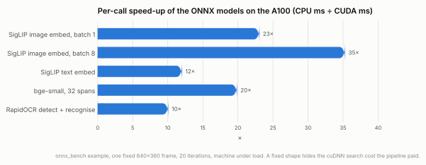

| Call | CPU (6 threads) | CUDA | Speed-up |
|---|---|---|---|
| SigLIP image embed, batch 1 | 270 ms | 11.7 ms | 23× |
| SigLIP image embed, batch 8 | 1623 ms | 46.0 ms | 35× |
| SigLIP text embed | 83 ms | 6.9 ms | 12× |
| bge-small, 32 spans | 165 ms | 8.3 ms | 20× |
| RapidOCR detect + recognise | 262 ms | 26.0 ms | 10× |

## Reproducing

```bash
# retrieval
python3 scripts/devset_eval.py /data/videoindex/indexes/dataset.vidx --config config/gcp-a100.toml --json /data/videoindex/eval/retrieval2.json
# question answering, agent and baseline
python3 scripts/devset_qa_eval.py /data/videoindex/indexes/dataset.vidx --config config/gcp-a100.toml --json /data/videoindex/eval/qa-agent2.json
python3 scripts/devset_qa_eval.py /data/videoindex/indexes/dataset.vidx --config config/gcp-a100.toml --policy retrieval-only --json /data/videoindex/eval/qa-retrieval-only.json
# Gemini agentic video on the same questions and files (needs GEMINI_API_KEY)
python3 scripts/gemini_video_eval.py --model gemini-3.8-flash --mode agentic --json /data/videoindex/eval/qa-gemini-agentic.json
# this report
python3 scripts/report/benchmark_report.py
```
