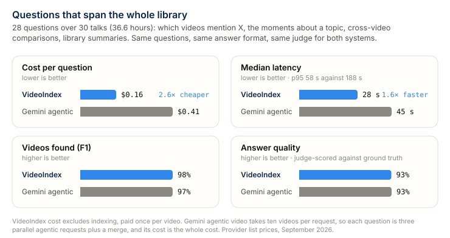
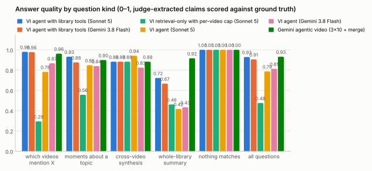
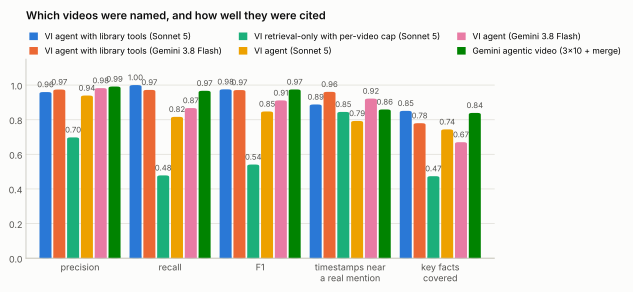
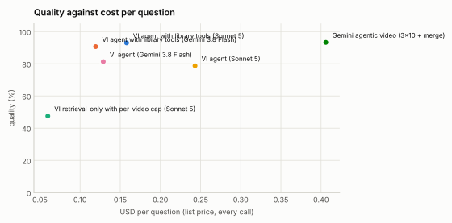
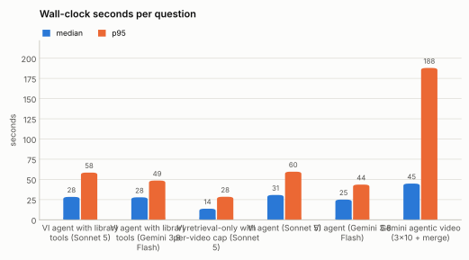
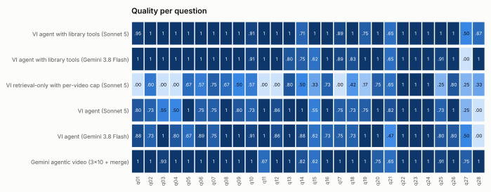

# Corpus QA: questions that span the whole library

Generated 2026-09-17 by `eval/corpus_report.py` from 6 run file(s) over the 28-question corpus set (`eval/data/corpus/questions.json`) on the 30-video `dataset` index.

Every system answered the same questions with the same answer format. A judge model (Claude Opus 5) turned each free-text answer into structure: the catalog videos it names, the timestamps it gives, and which key facts it states. Scoring after that is deterministic and identical for every system: set precision / recall / F1 of named videos against the expected set (videos with only an on-screen mention, or listed as ambiguous, count neither way), the share of cited timestamps within 90 s of a real mention in the index, key-fact coverage, and a per-question quality score (mention → F1; topic → mean of F1 and facts; synthesis → 0.3 F1 + 0.7 facts; whole-library → facts; nothing-matches → 1 unless a video is invented). Costs are provider list prices for every call a question needed; VideoIndex's costs exclude indexing (done once per video), Gemini's are the whole cost.

| Configuration | n | quality | precision | recall | F1 | timestamps near a mention | facts covered | wrong videos | missed videos |
|---|---|---|---|---|---|---|---|---|---|
| VideoIndex agent with library tools (claude-sonnet-5) | 28 | **93%** | 96% | 100% | 98% | 89% (n=232) | 85% | 7 | 0 |
| VideoIndex agent with library tools (gemini-3.8-flash) | 28 | **91%** | 97% | 97% | 97% | 96% (n=205) | 78% | 3 | 3 |
| VideoIndex retrieval-only with per-video cap (claude-sonnet-5) | 28 | **48%** | 70% | 48% | 54% | 85% (n=71) | 47% | 4 | 56 |
| VideoIndex agent (claude-sonnet-5) | 28 | **79%** | 94% | 82% | 85% | 79% (n=251) | 74% | 8 | 23 |
| VideoIndex agent (gemini-3.8-flash) | 28 | **81%** | 98% | 87% | 91% | 92% (n=192) | 67% | 2 | 14 |
| Gemini agentic video (gemini-3.8-flash, 3×10 videos + merge) | 28 | **93%** | 99% | 97% | 97% | 86% (n=334) | 84% | 1 | 3 |

| Configuration | cost / q | cost p95 | total | latency p50 | latency p95 | tool calls / q | tokens / q | budget hit |
|---|---|---|---|---|---|---|---|---|
| VideoIndex agent with library tools (claude-sonnet-5) | $0.158 | $0.33 | $4.42 | 28 s | 58 s | 5.8 | 42,121 | 2 |
| VideoIndex agent with library tools (gemini-3.8-flash) | $0.119 | $0.19 | $3.34 | 28 s | 49 s | 10.5 | 140,893 | 2 |
| VideoIndex retrieval-only with per-video cap (claude-sonnet-5) | $0.060 | $0.07 | $1.67 | 14 s | 28 s | 1.0 | 15,753 | 0 |
| VideoIndex agent (claude-sonnet-5) | $0.243 | $0.45 | $6.81 | 31 s | 60 s | 8.0 | 70,303 | 2 |
| VideoIndex agent (gemini-3.8-flash) | $0.129 | $0.17 | $3.61 | 25 s | 44 s | 11.4 | 155,496 | 1 |
| Gemini agentic video (gemini-3.8-flash, 3×10 videos + merge) | $0.406 | $1.19 | $11.37 | 45 s | 188 s | 31.8 | 165,591 | 0 |

Wrong videos: named videos outside the expected and acceptable sets (including invented titles), summed over all questions. Missed videos: expected videos not named. Latency is wall-clock per question as the runner saw it; Gemini's batches run in parallel, and the sequential sum is given in the runs section. Budget hit: answers cut short by the token, cost or time budget.

## Quality by question kind

| Kind | VideoIndex agent with library tools (claude-sonnet-5) | VideoIndex agent with library tools (gemini-3.8-flash) | VideoIndex retrieval-only with per-video cap (claude-sonnet-5) | VideoIndex agent (claude-sonnet-5) | VideoIndex agent (gemini-3.8-flash) | Gemini agentic video (gemini-3.8-flash, 3×10 videos + merge) |
|---|---|---|---|---|---|---|
| which videos mention X (n=13) | 98% | 98% | 29% | 78% | 87% | 96% |
| moments about a topic (n=8) | 93% | 88% | 56% | 85% | 84% | 90% |
| cross-video synthesis (n=3) | 88% | 88% | 88% | 94% | 82% | 88% |
| whole-library summary (n=3) | 72% | 67% | 46% | 42% | 43% | 92% |
| nothing matches (n=1) | 100% | 100% | 100% | 100% | 100% | 100% |

## Where this stands

The best VideoIndex configuration (VideoIndex agent with library tools (claude-sonnet-5)) scores 93% quality against 93% for Gemini agentic video (gemini-3.8-flash, 3×10 videos + merge), at $0.158 against $0.406 per question (2.6×) and a median 28 s against 45 s. VideoIndex named 7 wrong videos and missed 0; Gemini named 1 wrong and missed 3. Timestamps landed near a real mention 89% of the time for VideoIndex and 86% for Gemini.

Gemini's cost is uneven: 4 of 28 questions cost more than $1 (q01 (mention, $2.82), q02 (mention, $2.52), q20 (topic, $1.19), q18 (topic, $1.08)); on those the agent loaded transcript for most of the library and spent several hundred thousand thinking tokens, while the median question cost $0.11. VideoIndex's cost is flat because the index answers a library-wide scan with one full-text query; its agent's lost points are now extra videos (7 named outside the expected set) rather than missed ones, and facts the judge did not find in the answer (85% of key facts covered).

Rows marked 'with library tools' run the agent of 2026-09-17, which adds three exhaustive tools over the index: `find_mentions` (one full-text phrase query per term over every transcript segment, on-screen line and description, grouped by video with counts and the earliest timestamps), `count_mentions` (the same counts per term, per video or per channel) and `library_stats` (video count, duration, channels); `search` also caps hits per video so a ranked list spreads across the library. The system prompt routes 'which videos', 'find all', 'how many' and 'most discussed' questions to them before `search`. Against the same agent without them: 79% → 93% quality, 23 → 0 missed videos, $0.243 → $0.158 per question for VideoIndex agent (claude-sonnet-5); 81% → 91% quality, 14 → 3 missed videos, $0.129 → $0.119 per question for VideoIndex agent (gemini-3.8-flash). The remaining losses are extra videos on topic questions (the exhaustive scan surfaces peripheral mentions that the judge's ground truth does not list) and the ranking questions, where the counts include on-screen text and descriptions while the ground truth counts spoken mentions only.

Gemini's agentic video mode takes at most ten videos per request and the library does not fit its context window in static mode, so the Gemini row is a map-reduce: three agentic requests of ten videos each, run in parallel, and a text-only merge by the same model. That is the closest the public API comes to a whole-library question; a product built on it would have to add exactly the kind of index VideoIndex maintains. Gemini also receives the video titles in the prompt, as VideoIndex's agent does in its system prompt, so metadata questions are fair to both.

## Per-question results

| question | expected | VI agent with library tools (Sonnet 5) | VI agent with library tools (Gemini 3.8 Flash) | VI retrieval-only with per-video cap (Sonnet 5) | VI agent (Sonnet 5) | VI agent (Gemini 3.8 Flash) | Gemini agentic video (3×10 + merge) |
|---|---|---|---|---|---|---|---|
| **q01** (mention) Find all videos that mention Anthropic. | 9 | 0.95 (1 wrong) | 1.00 | 0.00 (9 missed) | 0.80 (3 missed) | 0.88 (2 missed) | 1.00 |
| **q02** (mention) Which videos mention DeepSeek (any DeepSeek model, such as R1 or V3)? | 7 | 1.00 | 1.00 | 0.60 (4 missed) | 0.73 (3 missed) | 0.73 (3 missed) | 1.00 |
| **q03** (mention) Which talks mention Cursor, the AI code editor? | 8 | 1.00 | 1.00 | 0.00 (8 missed) | 0.55 (5 missed) | 1.00 | 0.93 (1 missed) |
| **q04** (mention) Which videos talk about poker? | 3 | 1.00 | 1.00 | 0.00 (3 missed) | 0.50 (2 missed) | 0.80 (1 missed) | 1.00 |
| **q05** (mention) Which videos discuss prompt injection attacks? | 2 | 1.00 | 1.00 | 0.67 (1 missed) | 1.00 | 0.67 (1 missed) | 1.00 |
| **q06** (mention) Which talks mention LoRA (low-rank adaptation) fine-tuning? | 5 | 1.00 | 1.00 | 0.57 (3 missed) | 0.75 (2 missed) | 0.89 (1 missed) | 1.00 |
| **q07** (topic) Which video discusses Kubernetes, and in what context does the speaker bring it up? | 1 | 1.00 | 1.00 | 0.75 | 0.75 | 0.75 | 1.00 |
| **q08** (mention) Which videos mention Notion, the company or its product? | 2 | 1.00 | 1.00 | 0.67 (1 missed) | 1.00 | 1.00 | 1.00 |
| **q09** (mention) Which talks mention StarCraft? | 3 | 1.00 | 1.00 | 0.50 (2 missed) | 0.80 (1 missed) | 1.00 | 1.00 |
| **q10** (mention) Which videos mention Hugging Face? | 5 | 0.91 (1 wrong) | 0.91 (1 wrong) | 0.57 (3 missed) | 0.73 (2 wrong, 1 missed) | 0.91 (1 wrong) | 1.00 |
| **q11** (mention) Which speakers mention Kaggle? | 2 | 1.00 | 1.00 | 0.00 (2 missed) | 1.00 | 1.00 | 0.67 (1 missed) |
| **q12** (mention) In which videos is GRPO (the RL algorithm) mentioned? | 4 | 1.00 | 1.00 | 0.00 (4 missed) | 0.86 (1 missed) | 0.86 (1 missed) | 1.00 |
| **q13** (topic) Show me the moments where speakers talk about improving RAG (retrieval-augmented generation): better or multimodal retrieval, or evaluating retrieval quality. | 4 | 1.00 | 0.80 (1 missed) | 0.80 (1 missed) | 1.00 | 1.00 | 1.00 |
| **q14** (topic) Which talks explain reward models or reward functions in RL post-training, and what do they say about them? | 4 | 0.71 (4 wrong) | 0.75 (1 wrong, 1 missed) | 0.50 | 1.00 | 0.88 | 0.82 (1 wrong) |
| **q15** (topic) Where in the library is Mixture of Experts (MoE) explained, and how does each speaker describe it? | 4 | 1.00 | 0.62 | 0.33 (2 missed) | 0.55 (1 missed) | 0.62 | 0.62 |
| **q16** (topic) Which speakers refer to Rich Sutton's 'bitter lesson', and how do they use it? | 3 | 1.00 | 1.00 | 0.73 (1 missed) | 1.00 | 0.73 (1 missed) | 1.00 |
| **q17** (mention) Which talks discuss vector databases or vector stores? | 4 | 0.89 (1 wrong) | 0.89 (1 wrong) | 0.00 (4 missed) | 0.75 (1 wrong, 1 missed) | 0.75 (1 wrong, 1 missed) | 1.00 |
| **q18** (topic) Which talks cover guardrails for AI agents, and what kinds of guardrails do they describe? | 3 | 1.00 | 0.83 | 0.42 (2 missed) | 0.73 (1 missed) | 0.73 (1 missed) | 1.00 |
| **q19** (topic) Which talks discuss scaling laws? | 2 | 0.75 | 1.00 | 0.17 (3 wrong, 1 missed) | 0.75 (4 wrong) | 1.00 | 1.00 |
| **q20** (topic) Which speakers mention self-driving cars or autonomous vehicles, and in what connection? | 2 | 1.00 | 1.00 | 0.75 | 1.00 | 1.00 | 0.75 |
| **q21** (synthesis) Compare how Noam Brown and Oriol Vinyals talk about self-play: what did it achieve, and where does it break down? | 2 | 0.65 | 0.65 | 0.65 | 0.82 | 0.47 | 0.65 |
| **q22** (synthesis) How many talks in the library come from the UC Berkeley Agentic AI MOOC (CS294-196), and who are the speakers? | 11 | 1.00 | 1.00 | 1.00 | 1.00 | 1.00 | 1.00 |
| **q23** (synthesis) Which talks are given by Microsoft speakers, and which Microsoft products do they demonstrate? | 2 | 1.00 | 1.00 | 1.00 | 1.00 | 1.00 | 1.00 |
| **q24** (negative) Which videos mention Sam Altman? | 0 | 1.00 | 1.00 | 1.00 | 1.00 | 1.00 | 1.00 |
| **q25** (mention) Which videos talk about using an LLM as a judge for evaluation? | 6 | 1.00 | 0.91 (1 missed) | 0.25 (1 wrong, 5 missed) | 0.73 (1 wrong, 2 missed) | 0.80 (2 missed) | 0.91 (1 missed) |
| **q26** (library) Summarize the top themes across both event series in the library (the AI Engineer workshops and the UC Berkeley Agentic AI MOOC lectures). What do the two series have in common, and how do they differ? | 0 | 1.00 | 1.00 | 0.80 | 1.00 | 0.80 | 1.00 |
| **q27** (library) Which of these AI topics is talked about the most across the whole library: agents, evaluation, RAG, fine-tuning/RL, or MCP? Rank them and say roughly how concentrated each one is. | 0 | 0.50 | 0.00 | 0.25 | 0.25 | 0.50 | 0.75 |
| **q28** (library) Which model family is named most often across all the talks: GPT/ChatGPT, Gemini, Llama, Claude or DeepSeek? Give the ranking. | 0 | 0.67 | 1.00 | 0.33 | 0.00 | 0.00 | 1.00 |

## Runs

- **VideoIndex agent with library tools (claude-sonnet-5)**: `/data/videoindex/eval/runs/corpus/corpus-vi-agent-sonnet-v2.json` — total $4.42, judge ≈ $1.10; {"benchmark": "corpus", "system": "videoindex", "policy": "agent", "model": null, "budget_usd": 1.0, "budget_tokens": 200000, "budget_secs": 300, "max_tool_calls": 12, "max_answer_tokens": 4000, "vi_version": "vi 0.1.0", "started": "2026-09-17T06:25:42Z"}
- **VideoIndex agent with library tools (gemini-3.8-flash)**: `/data/videoindex/eval/runs/corpus/corpus-vi-agent-gemini-v2.json` — total $3.34, judge ≈ $1.05; {"benchmark": "corpus", "system": "videoindex", "policy": "agent", "model": "gemini-3.8-flash", "budget_usd": 1.0, "budget_tokens": 200000, "budget_secs": 300, "max_tool_calls": 12, "max_answer_tokens": 4000, "vi_version": "vi 0.1.0", "started": "2026-09-17T06:31:14Z"}
- **VideoIndex retrieval-only with per-video cap (claude-sonnet-5)**: `/data/videoindex/eval/runs/corpus/corpus-vi-retrieval-only-v2.json` — total $1.67, judge ≈ $0.87; {"benchmark": "corpus", "system": "videoindex", "policy": "retrieval-only", "model": null, "budget_usd": 1.0, "budget_tokens": 200000, "budget_secs": 300, "max_tool_calls": 12, "max_answer_tokens": 4000, "vi_version": "vi 0.1.0", "started": "2026-09-17T06:36:13Z"}
- **VideoIndex agent (claude-sonnet-5)**: `/data/videoindex/eval/runs/corpus/corpus-vi-agent-sonnet.json` — total $6.81, judge ≈ $1.07; {"benchmark": "corpus", "system": "videoindex", "policy": "agent", "model": null, "budget_usd": 1.0, "budget_tokens": 200000, "budget_secs": 300, "max_tool_calls": 12, "max_answer_tokens": 4000, "vi_version": "vi 0.1.0", "started": "2026-09-16T17:05:59Z"}
- **VideoIndex agent (gemini-3.8-flash)**: `/data/videoindex/eval/runs/corpus/corpus-vi-agent-gemini.json` — total $3.61, judge ≈ $0.97; {"benchmark": "corpus", "system": "videoindex", "policy": "agent", "model": "gemini-3.8-flash", "budget_usd": 1.0, "budget_tokens": 200000, "budget_secs": 300, "max_tool_calls": 12, "max_answer_tokens": 4000, "vi_version": "vi 0.1.0", "started": "2026-09-16T17:13:58Z"}
- **Gemini agentic video (gemini-3.8-flash, 3×10 videos + merge)**: `/data/videoindex/eval/runs/corpus/corpus-gemini-agentic.json` — total $11.37, judge ≈ $1.29; sequential-sum latency p50 100 s; {"benchmark": "corpus", "system": "gemini", "policy": "gemini-agentic-mapreduce", "model": "gemini-3.8-flash", "thinking": null, "batch_size": 10, "batches": 3, "price_in": 0.75, "price_out": 3.75, "started": "2026-09-16T17:06:44Z"}

The ground truth for mention questions comes from the index's own ASR transcript and OCR text, so it inherits their errors (the set notes the known ones, such as 'Laura' for LoRA). A system that hears a mention the transcript missed is scored as wrong; the per-question table and the judge assessments in the run files are the place to check such cases.
