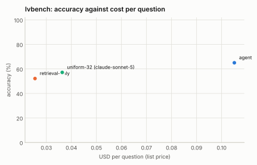

# LVBench: 25% stratified sample (seed 1) over the 50 videos available

Generated 2026-09-12 by `eval/report.py` from 3 run file(s). Accuracy is exact match on the option letter; intervals are 95% Wilson. Costs are provider list prices per question; indexing cost is not included for the index-based configurations.

| Configuration | n | accuracy | 95% CI | unparsed | cost / q | tokens / q | tool calls / q | latency p50 | latency p95 | no-decode | citation in range |
|---|---|---|---|---|---|---|---|---|---|---|---|
| agent | 184 | **64.1%** | 57.0–70.7 | 2 | $0.104 | 29,813 | 4.16 | 15.3 s | 42.4 s | 36% | 74% (n=182) |
| retrieval-only | 184 | **51.1%** | 43.9–58.2 | 0 | $0.025 | 6,642 | 1.00 | 9.0 s | 14.8 s | 100% | 54% (n=183) |
| uniform-32 (claude-sonnet-5) | 184 | **54.9%** | 47.7–61.9 | 5 | $0.036 | 11,404 | 0.00 | 12.1 s | 19.3 s | 100% | — |

## Reading the sample

- **Scope.** The 25% stratified sample is 387 questions; 184 of them have indexed videos (50 of LVBench's 103 videos are on the machine, 11 are gone from YouTube, the rest wait on YouTube's rate limit). The question set is fixed by `(seed 1, fraction 0.25)`, so later passes fill in the same sample rather than a different one.
- **The agent leads both baselines by 9 to 13 points** (64.1% against 54.9% and 51.1%; the agent's 95% interval excludes the retrieval-only point but overlaps the uniform baseline's), at about 3 to 4× their cost per question. Its margin is largest where finding the moment matters: temporal grounding 80% vs 55%/65%, key information retrieval 74% vs 48%/57%.
- **Where the index-based agent does not help.** Summarization (n=7) is worse for the agent than for the baselines: a question about the whole video is answered better by 32 frames spanning it than by a few searches. Event understanding is close (63% vs 61% uniform). These are the two task types where a "view the whole video coarsely first" step would pay.
- **Retrieval-only is the cheapest configuration** ($0.025 per question) and within 4 points of the uniform-frames baseline that costs 40% more and decodes at question time.
- **Citations**: 74% of the agent's answers cite a moment within 60 s of LVBench's `time_reference`.

## Accuracy by task type

| Task type | agent | retrieval-only | uniform-32 (claude-sonnet-5) |
|---|---|---|---|
| entity recognition | 62% (n=74) | 47% (n=74) | 54% (n=74) |
| event understanding | 63% (n=71) | 52% (n=71) | 61% (n=71) |
| key information retrieval | 74% (n=42) | 57% (n=42) | 48% (n=42) |
| reasoning | 62% (n=21) | 43% (n=21) | 62% (n=21) |
| summarization | 29% (n=7) | 57% (n=7) | 57% (n=7) |
| temporal grounding | 80% (n=20) | 65% (n=20) | 55% (n=20) |

## Tool-call profiles

**agent**: `search > search > view` ×24; `search > search` ×17; `view` ×10; `search` ×7; `search > search > get_transcript` ×5; `search > search > view > search > search > view` ×4; `(none)` ×3; `search > search > get_transcript > search > search > get_transcript` ×3

**retrieval-only**: `search` ×184

**uniform-32 (claude-sonnet-5)**: `(none)` ×184

## Runs

- **agent**: `/data/videoindex/eval/runs/lvbench-f0.25-s1-agent.json` — {"benchmark": "lvbench", "policy": "agent", "budget_usd": 0.5, "budget_tokens": 120000, "max_tool_calls": 6, "sample": 387, "fraction": 0.25, "seed": 1, "skipped_not_indexed": 203, "vi_version": "vi 0.1.0", "started": "2026-09-12T16:45:57Z"}
- **retrieval-only**: `/data/videoindex/eval/runs/lvbench-f0.25-s1-retrieval-only.json` — {"benchmark": "lvbench", "policy": "retrieval-only", "budget_usd": 0.5, "budget_tokens": 120000, "max_tool_calls": 6, "sample": 387, "fraction": 0.25, "seed": 1, "skipped_not_indexed": 203, "vi_version": "vi 0.1.0", "started": "2026-09-12T16:47:49Z"}
- **uniform-32 (claude-sonnet-5)**: `/data/videoindex/eval/runs/lvbench-f0.25-s1-uniform-32.json` — {"benchmark": "lvbench", "policy": "uniform-32", "model": "claude-sonnet-5", "frames": 32, "transcript": true, "sample": 387, "fraction": 0.25, "seed": 1, "started": "2026-09-12T16:47:49Z"}

Questions per run: up to 184. Benchmark videos are public YouTube content and may be in model training data; read per-configuration deltas rather than absolute scores.
