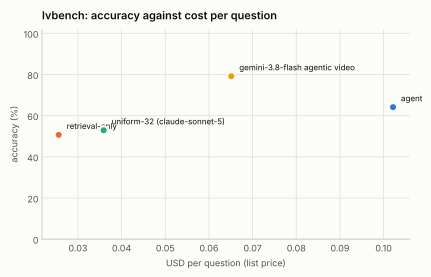

# LVBench: 25% stratified sample (seed 1), 92 of 103 videos reachable

Generated 2026-09-14 by `eval/report.py` from 4 run file(s). Accuracy is exact match on the option letter; intervals are 95% Wilson. Costs are provider list prices per question; indexing cost is not included for the index-based configurations.

| Configuration | n | accuracy | 95% CI | unparsed | cost / q | tokens / q | tool calls / q | latency p50 | latency p95 | no-decode | citation in range |
|---|---|---|---|---|---|---|---|---|---|---|---|
| agent | 340 | **66.2%** | 61.0–71.0 | 2 | $0.099 | 28,348 | 4.08 | 14.3 s | 44.2 s | 39% | 74% (n=336) |
| retrieval-only | 340 | **50.3%** | 45.0–55.6 | 1 | $0.025 | 6,672 | 1.01 | 8.5 s | 15.2 s | 100% | 58% (n=339) |
| uniform-32 (claude-sonnet-5) | 340 | **52.1%** | 46.8–57.3 | 14 | $0.037 | 11,718 | 0.00 | 11.8 s | 22.3 s | 100% | — |
| gemini-3.8-flash agentic video | 338 | **80.8%** | 76.2–84.6 | 14 | $0.059 | 39,531 | 3.40 | 13.2 s | 95.6 s | 100% | — |

## Reading the sample

- **Scope.** LVBench (1,549 four-way questions over 103 hour-long YouTube videos). The 25% stratified sample is 387 questions fixed by `(seed 1, fraction 0.25)`; 340 have their videos on the machine (11 of the 103 videos are gone from YouTube). Every row answered the same 340 questions except Gemini's 338 (two requests failed with "model generated too many tool calls"). Chance is 25%. The VideoIndex rows include one re-ask of answers that came back without an option letter.
- **Gemini 3.8 Flash agentic video: 80.8% against 66.2% for the VideoIndex agent**, at 60% of its cost per question ($0.059 vs $0.099) and similar median latency (13 s vs 14 s; Gemini's p95 is 96 s vs 44 s). It leads on every task type: most on summarization (100% vs 36%, n=14), event understanding (81% vs 64%) and entity recognition (78% vs 65%), the visual types; least on reasoning (67% vs 61%) and key information retrieval (88% vs 76%). The pattern matches MINERVA: the index carries speech and on-screen text well, the pixels less so.
- **Against its own baselines the VideoIndex agent leads by 14 to 16 points** (66.2% vs 52.1% uniform-32-frames and 50.3% retrieval-only) at 2.7 to 4× their cost, with the largest margins on temporal grounding (78% vs 53%/56%) and key information retrieval (76% vs 45%/57%). Summarization is the one type where the agent trails its own uniform baseline (36% vs 43%): a few searches do not summarise an hour, 32 frames across it do.
- **Retrieval-only is the cheapest row** ($0.025) and within 2 points of the uniform baseline that costs 50% more and decodes at question time; 58% of its answers cite a moment within 60 s of LVBench's `time_reference`, 74% for the agent.
- **What this says about the system.** Same three levers as MINERVA, in the order the numbers support: a stronger frame model in the coarse pass (SigLIP so400m-384), a whole-video coarse view step for summary and event questions (where the uniform baseline beats the agent), and denser `view` grids plus VLM descriptions when a question is about what is visible. Cost caveat in both directions: VideoIndex's per-question cost excludes indexing (about 1.5 minutes of GPU time per video hour here, amortised over every question), Gemini's excludes nothing.

## Where this stands against Gemini agentic video

The `gemini-…` row is Google's Gemini 3.8 Flash with `processing: "agentic"` asked the same questions over the same video files through the Interactions API (run once and cached; it is not re-run with every matrix). Google's own announcement ("Introducing agentic video in Gemini", 2026-09-01) reports agentic mode against static whole-video processing on LongVideoBench as up to 88% fewer tokens, up to 66% lower cost and up to 7% higher accuracy, without absolute scores; the numbers here are absolute, on LVBench, and directly comparable across rows because every row answered the same questions under the same scoring. VideoIndex's per-question cost excludes indexing (done once per video); Gemini's per-question cost is the whole cost. Both systems are scored with the same letter parser.

## Accuracy by task type

| Task type | agent | retrieval-only | uniform-32 (claude-sonnet-5) | gemini-3.8-flash agentic video |
|---|---|---|---|---|
| entity recognition | 65% (n=139) | 45% (n=139) | 50% (n=139) | 78% (n=138) |
| event understanding | 64% (n=135) | 50% (n=135) | 57% (n=135) | 81% (n=135) |
| key information retrieval | 76% (n=74) | 57% (n=74) | 45% (n=74) | 88% (n=73) |
| reasoning | 61% (n=38) | 45% (n=38) | 55% (n=38) | 67% (n=36) |
| summarization | 36% (n=14) | 50% (n=14) | 43% (n=14) | 100% (n=14) |
| temporal grounding | 78% (n=36) | 56% (n=36) | 53% (n=36) | 92% (n=36) |

## Tool-call profiles

**agent**: `search > search > view` ×44; `search > search` ×30; `search` ×21; `view` ×16; `search > view` ×10; `search > search > get_transcript` ×8; `search > search > view > view > view > view` ×6; `search > search > search > search > search > search` ×6

**retrieval-only**: `search` ×340

**uniform-32 (claude-sonnet-5)**: `(none)` ×340

**gemini-3.8-flash agentic video**: `processing_call×2` ×109; `processing_call×1` ×81; `processing_call×3` ×50; `processing_call×4` ×26; `processing_call×5` ×20; `processing_call×6` ×12; `processing_call×7` ×10; `processing_call×8` ×8

## Runs

- **agent**: `/data/videoindex/eval/runs/lvbench-f0.25-s1-agent.json` — {"benchmark": "lvbench", "policy": "agent", "budget_usd": 0.5, "budget_tokens": 120000, "max_tool_calls": 6, "sample": 387, "fraction": 0.25, "seed": 1, "skipped_not_indexed": 47, "vi_version": "vi 0.1.0", "started": "2026-09-14T00:47:44Z"}
- **retrieval-only**: `/data/videoindex/eval/runs/lvbench-f0.25-s1-retrieval-only.json` — {"benchmark": "lvbench", "policy": "retrieval-only", "budget_usd": 0.5, "budget_tokens": 120000, "max_tool_calls": 6, "sample": 387, "fraction": 0.25, "seed": 1, "skipped_not_indexed": 47, "vi_version": "vi 0.1.0", "started": "2026-09-14T00:50:02Z"}
- **uniform-32 (claude-sonnet-5)**: `/data/videoindex/eval/runs/lvbench-f0.25-s1-uniform-32.json` — {"benchmark": "lvbench", "policy": "uniform-32", "model": "claude-sonnet-5", "frames": 32, "transcript": true, "sample": 387, "fraction": 0.25, "seed": 1, "started": "2026-09-13T23:44:46Z"}
- **gemini-3.8-flash agentic video**: `/data/videoindex/eval/runs/lvbench-f0.25-s1-gemini-3.8-flash-agentic.json` — {"benchmark": "lvbench", "policy": "gemini-agentic", "model": "gemini-3.8-flash", "mode": "agentic", "thinking": null, "sample": 387, "fraction": 0.25, "seed": 1, "started": "2026-09-14T03:56:39Z"}

Questions per run: up to 340. Benchmark videos are public YouTube content and may be in model training data; read per-configuration deltas rather than absolute scores.
