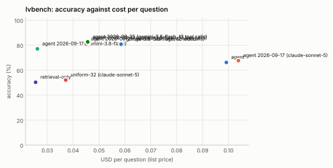

# lvbench: 25% stratified sample, seed 1

Generated 2026-09-26 by `eval/report.py` from 9 run file(s). Accuracy is exact match on the option letter; intervals are 95% Wilson. Costs are provider list prices per question; indexing cost is not included for the index-based configurations.

| Configuration | n | accuracy | 95% CI | unparsed | cost / q | tokens / q | tool calls / q | latency p50 | latency p95 | no-decode | citation in range |
|---|---|---|---|---|---|---|---|---|---|---|---|
| agent | 340 | **66.2%** | 61.0–71.0 | 2 | $0.099 | 28,348 | 4.08 | 14.3 s | 44.2 s | 39% | 74% (n=336) |
| agent 2026-09-17 (claude-sonnet-5) | 340 | **67.6%** | 62.5–72.4 | 1 | $0.104 | 30,479 | 4.03 | 15.0 s | 39.9 s | 49% | 74% (n=331) |
| agent 2026-09-17 (gemini-3.8-flash) | 340 | **77.1%** | 72.3–81.2 | 0 | $0.026 | 28,854 | 4.45 | 15.6 s | 33.5 s | 31% | 74% (n=319) |
| agent 2026-09-17 (gemini-3.8-flash, 12 tool calls) | 340 | **81.8%** | 77.3–85.5 | 0 | $0.046 | 52,312 | 6.23 | 16.5 s | 54.7 s | 23% | 80% (n=318) |
| agent 2026-09-21 (gemini-3.8-flash, 12 tool calls) | 340 | **80.9%** | 76.4–84.7 | 0 | $0.045 | 51,530 | 6.36 | 15.5 s | 53.4 s | 23% | 81% (n=318) |
| agent 2026-09-25 (gemini-3.8-flash, 12 tool calls) | 340 | **82.6%** | 78.3–86.3 | 0 | $0.046 | 51,934 | 6.53 | 11.9 s | 48.1 s | 22% | 82% (n=332) |
| retrieval-only | 340 | **50.3%** | 45.0–55.6 | 1 | $0.025 | 6,672 | 1.01 | 8.5 s | 15.2 s | 100% | 58% (n=339) |
| uniform-32 (claude-sonnet-5) | 340 | **52.1%** | 46.8–57.3 | 14 | $0.037 | 11,718 | 0.00 | 11.8 s | 22.3 s | 100% | — |
| gemini-3.8-flash agentic video | 338 | **80.8%** | 76.2–84.6 | 14 | $0.059 | 39,531 | 3.40 | 13.2 s | 95.6 s | 100% | — |

## Where this stands against Gemini agentic video

The `gemini-…` row is Google's Gemini 3.8 Flash with `processing: "agentic"` asked the same questions over the same video files through the Interactions API (run once and cached; it is not re-run with every matrix). Google's own announcement ("Introducing agentic video in Gemini", 2026-09-01) reports agentic mode against static whole-video processing on LongVideoBench as up to 88% fewer tokens, up to 66% lower cost and up to 7% higher accuracy, without absolute scores; the numbers here are absolute, on LVBench, and directly comparable across rows because every row answered the same questions under the same scoring. VideoIndex's per-question cost excludes indexing (done once per video); Gemini's per-question cost is the whole cost. Both systems are scored with the same letter parser.

## Accuracy by task type

| Task type | agent | agent 2026-09-17 (claude-sonnet-5) | agent 2026-09-17 (gemini-3.8-flash) | agent 2026-09-17 (gemini-3.8-flash, 12 tool calls) | agent 2026-09-21 (gemini-3.8-flash, 12 tool calls) | agent 2026-09-25 (gemini-3.8-flash, 12 tool calls) | retrieval-only | uniform-32 (claude-sonnet-5) | gemini-3.8-flash agentic video |
|---|---|---|---|---|---|---|---|---|---|
| entity recognition | 65% (n=139) | 69% (n=139) | 78% (n=139) | 79% (n=139) | 79% (n=139) | 82% (n=139) | 45% (n=139) | 50% (n=139) | 78% (n=138) |
| event understanding | 64% (n=135) | 69% (n=135) | 76% (n=135) | 82% (n=135) | 81% (n=135) | 84% (n=135) | 50% (n=135) | 57% (n=135) | 81% (n=135) |
| key information retrieval | 76% (n=74) | 70% (n=74) | 82% (n=74) | 88% (n=74) | 86% (n=74) | 88% (n=74) | 57% (n=74) | 45% (n=74) | 88% (n=73) |
| reasoning | 61% (n=38) | 53% (n=38) | 61% (n=38) | 66% (n=38) | 68% (n=38) | 68% (n=38) | 45% (n=38) | 55% (n=38) | 67% (n=36) |
| summarization | 36% (n=14) | 50% (n=14) | 93% (n=14) | 100% (n=14) | 93% (n=14) | 86% (n=14) | 50% (n=14) | 43% (n=14) | 100% (n=14) |
| temporal grounding | 78% (n=36) | 78% (n=36) | 92% (n=36) | 92% (n=36) | 89% (n=36) | 89% (n=36) | 56% (n=36) | 53% (n=36) | 92% (n=36) |

## Tool-call profiles

**agent**: `search > search > view` ×44; `search > search` ×30; `search` ×21; `view` ×16; `search > view` ×10; `search > search > get_transcript` ×8; `search > search > view > view > view > view` ×6; `search > search > search > search > search > search` ×6

**agent 2026-09-17 (claude-sonnet-5)**: `search` ×17; `view` ×16; `search > find_mentions` ×15; `search > find_mentions > view` ×15; `search > search > view` ×12; `(none)` ×8; `search > search` ×8; `search > get_transcript` ×8

**agent 2026-09-17 (gemini-3.8-flash)**: `view` ×15; `search > get_transcript` ×10; `search > get_transcript > view` ×9; `search > view` ×9; `search > get_transcript > get_ocr > view` ×4; `search > get_ocr > view` ×4; `get_transcript > view` ×4; `get_ocr > view` ×4

**agent 2026-09-17 (gemini-3.8-flash, 12 tool calls)**: `view` ×13; `search > get_transcript` ×9; `search > view` ×8; `get_transcript > view` ×7; `search > get_transcript > view` ×7; `find_mentions > get_transcript > get_transcript > view` ×5; `search > get_transcript > view > view` ×5; `search > get_ocr > view` ×5

**agent 2026-09-21 (gemini-3.8-flash, 12 tool calls)**: `view` ×15; `view > view` ×5; `get_transcript > view` ×4; `get_ocr > view` ×4; `get_transcript` ×4; `search > search > get_transcript > view` ×4; `find_mentions > get_transcript` ×4; `find_mentions > get_ocr > view` ×3

**agent 2026-09-25 (gemini-3.8-flash, 12 tool calls)**: `view` ×14; `search > find_mentions > get_transcript > get_ocr > view` ×6; `get_transcript > view` ×5; `find_mentions > get_transcript > get_transcript` ×5; `search > view` ×5; `get_ocr > view` ×4; `timeline > view` ×4; `get_transcript` ×3

**retrieval-only**: `search` ×340

**uniform-32 (claude-sonnet-5)**: `(none)` ×340

**gemini-3.8-flash agentic video**: `processing_call×2` ×109; `processing_call×1` ×81; `processing_call×3` ×50; `processing_call×4` ×26; `processing_call×5` ×20; `processing_call×6` ×12; `processing_call×7` ×10; `processing_call×8` ×8

## Runs

- **agent**: `/data/videoindex/eval/runs/lvbench-f0.25-s1-agent.json` — {"benchmark": "lvbench", "policy": "agent", "budget_usd": 0.5, "budget_tokens": 120000, "max_tool_calls": 6, "sample": 387, "fraction": 0.25, "seed": 1, "skipped_not_indexed": 47, "vi_version": "vi 0.1.0", "started": "2026-09-14T00:47:44Z"}
- **agent 2026-09-17 (claude-sonnet-5)**: `/data/videoindex/eval/runs/lvbench-f0.25-s1-agent-v2.json` — {"benchmark": "lvbench", "policy": "agent", "model": null, "label": "agent 2026-09-17 (claude-sonnet-5)", "budget_usd": 0.5, "budget_tokens": 120000, "max_tool_calls": 6, "sample": 387, "fraction": 0.25, "seed": 1, "skipped_not_indexed": 47, "vi_version": "vi 0.1.0", "started": "2026-09-17T14:46:27Z"}
- **agent 2026-09-17 (gemini-3.8-flash)**: `/data/videoindex/eval/runs/lvbench-f0.25-s1-agent-gemini.json` — {"benchmark": "lvbench", "policy": "agent", "model": "gemini-3.8-flash", "budget_usd": 0.5, "budget_tokens": 120000, "max_tool_calls": 6, "sample": 387, "fraction": 0.25, "seed": 1, "skipped_not_indexed": 47, "vi_version": "vi 0.1.0", "started": "2026-09-17T13:51:41Z", "label": "agent 2026-09-17 (gemini-3.8-flash)"}
- **agent 2026-09-17 (gemini-3.8-flash, 12 tool calls)**: `/data/videoindex/eval/runs/lvbench-f0.25-s1-agent-gemini-tc12.json` — {"benchmark": "lvbench", "policy": "agent", "model": "gemini-3.8-flash", "label": "agent 2026-09-17 (gemini-3.8-flash, 12 tool calls)", "budget_usd": 0.5, "budget_tokens": 120000, "max_tool_calls": 12, "sample": 387, "fraction": 0.25, "seed": 1, "skipped_not_indexed": 47, "vi_version": "vidx 0.1.0", "started": "2026-09-21T05:54:19Z"}
- **agent 2026-09-21 (gemini-3.8-flash, 12 tool calls)**: `/data/videoindex/eval/runs/lvbench-f0.25-s1-agent-gemini-v3-tc12.json` — {"benchmark": "lvbench", "policy": "agent", "model": "gemini-3.8-flash", "label": "agent 2026-09-21 (gemini-3.8-flash, 12 tool calls)", "budget_usd": 0.5, "budget_tokens": 120000, "max_tool_calls": 12, "sample": 387, "fraction": 0.25, "seed": 1, "skipped_not_indexed": 47, "vi_version": "vidx 0.1.0", "started": "2026-09-21T07:10:32Z"}
- **agent 2026-09-25 (gemini-3.8-flash, 12 tool calls)**: `/data/videoindex/eval/runs/lvbench-f0.25-s1-agent-gemini-v4-tc12.json` — {"benchmark": "lvbench", "policy": "agent", "model": "gemini-3.8-flash", "label": "agent 2026-09-25 (gemini-3.8-flash, 12 tool calls)", "budget_usd": 0.5, "budget_tokens": 120000, "max_tool_calls": 12, "sample": 387, "fraction": 0.25, "seed": 1, "skipped_not_indexed": 47, "vi_version": "vidx 0.1.0", "started": "2026-09-26T00:08:33Z"}
- **retrieval-only**: `/data/videoindex/eval/runs/lvbench-f0.25-s1-retrieval-only.json` — {"benchmark": "lvbench", "policy": "retrieval-only", "budget_usd": 0.5, "budget_tokens": 120000, "max_tool_calls": 6, "sample": 387, "fraction": 0.25, "seed": 1, "skipped_not_indexed": 47, "vi_version": "vi 0.1.0", "started": "2026-09-14T00:50:02Z"}
- **uniform-32 (claude-sonnet-5)**: `/data/videoindex/eval/runs/lvbench-f0.25-s1-uniform-32.json` — {"benchmark": "lvbench", "policy": "uniform-32", "model": "claude-sonnet-5", "frames": 32, "transcript": true, "sample": 387, "fraction": 0.25, "seed": 1, "started": "2026-09-13T23:44:46Z"}
- **gemini-3.8-flash agentic video**: `/data/videoindex/eval/runs/lvbench-f0.25-s1-gemini-3.8-flash-agentic.json` — {"benchmark": "lvbench", "policy": "gemini-agentic", "model": "gemini-3.8-flash", "mode": "agentic", "thinking": null, "sample": 387, "fraction": 0.25, "seed": 1, "started": "2026-09-14T03:56:39Z"}

Questions per run: up to 340. Benchmark videos are public YouTube content and may be in model training data; read per-configuration deltas rather than absolute scores.
