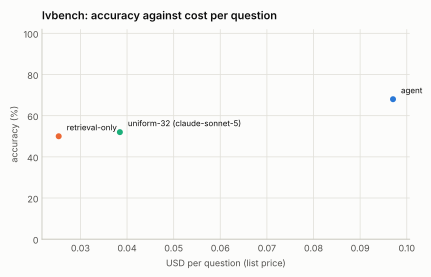

# LVBench pilot: 100 questions over 17 videos

Generated 2026-09-12 by `eval/report.py` from 3 run file(s). Accuracy is exact match on the option letter; intervals are 95% Wilson. Costs are provider list prices per question; indexing cost is not included for the index-based configurations.

| Configuration | n | accuracy | 95% CI | unparsed | cost / q | tokens / q | tool calls / q | latency p50 | latency p95 | no-decode | citation in range |
|---|---|---|---|---|---|---|---|---|---|---|---|
| agent | 100 | **68.0%** | 58.3–76.3 | 1 | $0.097 | 28,216 | 4.32 | 14.8 s | 33.8 s | 37% | 64% (n=98) |
| retrieval-only | 100 | **50.0%** | 40.4–59.6 | 1 | $0.025 | 6,763 | 1.00 | 7.3 s | 13.3 s | 100% | 54% (n=94) |
| uniform-32 (claude-sonnet-5) | 100 | **52.0%** | 42.3–61.5 | 1 | $0.038 | 12,294 | 0.00 | 10.9 s | 16.6 s | 100% | — |

## Reading the pilot

- **Scope.** 100 questions stratified by task type over the 17 LVBench videos that had been downloaded and indexed at the time (YouTube's bot check paused the rest); the 95% intervals are wide and the per-type cells small. Treat this as a pipeline check and a first signal, not the LVBench number.
- **The agent leads by 16 to 18 points** over both baselines at about 2.5 to 4× their cost per question. Its gains are largest on temporal grounding (92% vs 42%) and reasoning (92% vs 54%): questions where finding the moment matters. On entity recognition it is ahead of both, and summarization (n=5) is weak for every configuration.
- **Retrieval-only equals the uniform-frames baseline** at half the cost: an index and one search buy what 32 uniformly sampled frames plus the caption file buy, without decoding anything at question time.
- **Two harness fixes came out of the first pass** of this pilot: the agent returned empty text after tool-heavy turns and the retrieval-only policy wrote pseudo tool calls when tools were withheld. Final turns now keep the tool definitions with `tool_choice: none` (accuracy 58% to 68% and 18% to 50% on the same questions).
- **Citations.** 64% of the agent's answers carry a citation within 60 s of LVBench's `time_reference`; the benchmark does not ask for one, so this is a bonus signal of grounding.
- **Cost.** Index-based rows exclude indexing: 17 videos (about 19 hours) took 45 minutes of machine time on the GPU build and no API calls.

## Accuracy by task type

| Task type | agent | retrieval-only | uniform-32 (claude-sonnet-5) |
|---|---|---|---|
| entity recognition | 64% (n=47) | 49% (n=47) | 43% (n=47) |
| event understanding | 67% (n=45) | 53% (n=45) | 53% (n=45) |
| key information retrieval | 75% (n=12) | 67% (n=12) | 58% (n=12) |
| reasoning | 92% (n=13) | 54% (n=13) | 77% (n=13) |
| summarization | 40% (n=5) | 0% (n=5) | 40% (n=5) |
| temporal grounding | 92% (n=12) | 42% (n=12) | 42% (n=12) |

## Tool-call profiles

**agent**: `search > search > view` ×16; `search > search` ×5; `search > view` ×4; `search > search > search > search > timeline > search > search` ×4; `search > search > search > search > search > search` ×3; `search > search > view > view > describe > view` ×3; `search > search > search > search > search > view` ×3; `search` ×3

**retrieval-only**: `search` ×100

**uniform-32 (claude-sonnet-5)**: `(none)` ×100

## Runs

- **agent**: `/data/videoindex/eval/runs/lvbench-pilot-agent.json` — {"benchmark": "lvbench", "policy": "agent", "budget_usd": 0.5, "budget_tokens": 120000, "max_tool_calls": 6, "sample": 100, "seed": 1, "vi_version": "vi 0.1.0", "started": "2026-09-12T07:43:18Z"}
- **retrieval-only**: `/data/videoindex/eval/runs/lvbench-pilot-retrieval.json` — {"benchmark": "lvbench", "policy": "retrieval-only", "budget_usd": 0.5, "budget_tokens": 120000, "max_tool_calls": 6, "sample": 100, "seed": 1, "vi_version": "vi 0.1.0", "started": "2026-09-12T07:50:36Z"}
- **uniform-32 (claude-sonnet-5)**: `/data/videoindex/eval/runs/lvbench-pilot-uniform32.json` — {"benchmark": "lvbench", "policy": "uniform-32", "model": "claude-sonnet-5", "frames": 32, "transcript": true, "sample": 100, "seed": 1, "started": "2026-09-12T07:54:07Z"}

Questions per run: up to 100. Benchmark videos are public YouTube content and may be in model training data; read per-configuration deltas rather than absolute scores.
