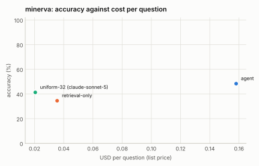

# MINERVA: 25% stratified sample (seed 1)

Generated 2026-09-14 by `eval/report.py` from 4 run file(s). Accuracy is exact match on the option letter; intervals are 95% Wilson. Costs are provider list prices per question; indexing cost is not included for the index-based configurations.

| Configuration | n | accuracy | 95% CI | unparsed | cost / q | tokens / q | tool calls / q | latency p50 | latency p95 | no-decode | citation in range |
|---|---|---|---|---|---|---|---|---|---|---|---|
| agent | 310 | **51.9%** | 46.4–57.4 | 22 | $0.150 | 40,830 | 4.84 | 24.2 s | 76.2 s | 14% | — |
| retrieval-only | 310 | **37.1%** | 31.9–42.6 | 11 | $0.034 | 8,624 | 1.10 | 11.0 s | 33.0 s | 100% | — |
| uniform-32 (claude-sonnet-5) | 310 | **41.3%** | 35.9–46.8 | 35 | $0.021 | 5,802 | 0.00 | 13.7 s | 22.7 s | 100% | — |
| gemini-3.8-flash agentic video | 310 | **76.5%** | 71.4–80.8 | 6 | $0.051 | 45,673 | 4.08 | 16.2 s | 134.9 s | 100% | — |

## Reading the sample

- **Scope.** MINERVA (Google DeepMind, 1,291 five-way questions with reasoning traces over 188 YouTube videos averaging about 12 minutes). The 25% stratified sample is 323 questions; 310 had their videos on the machine (the rest are unavailable on YouTube). Every row answered the same 310 questions; chance is 20%. The VideoIndex rows include one re-ask of answers that came back without an option letter.
- **Gemini 3.8 Flash agentic video: 76.5%, against 51.9% for the VideoIndex agent**, at a third of the cost per question ($0.051 vs $0.150) and lower median latency (16 s vs 24 s, with a long p95 tail of 135 s). This is a larger gap than on LVBench (79.1% vs 66.2%), and the task-type table says why: MINERVA asks for perception and short-range reasoning over short clips (counting 62% vs 38%, spatial perception 73% vs 36%, counterfactual 75% vs 12%, event occurrence 78% vs 49%), where an index of transcript, on-screen text and a base SigLIP embedding has little to offer and the agent's 3×3 `view` grids are too coarse. The gap narrows on the text-anchored types: reading 83% vs 72%, listening 88% vs 66%.
- **Against its own baselines the agent still leads** (51.9% vs 41.3% uniform-32-frames and 37.1% retrieval-only), but at 7× the uniform baseline's cost; on these short videos 32 frames already cover the whole clip, so the baseline is cheap ($0.021) and competitive. Retrieval-only is weak here because most questions are not about what was said.
- **Empty answers persist.** 22 of the agent's 310 answers (7%) had no option letter even after the re-ask (down from 46 before the answer-from-notes fallback and option-text matching); the uniform baseline had 35, Gemini 6. Unparsed answers count as wrong for every row.
- **What this says about the system.** MINERVA is the benchmark for the visual side that LVBench only hinted at. The levers are the same, now with numbers behind them: a stronger frame model in the coarse pass, a whole-clip view step for short videos (the uniform baseline's 32 frames are exactly that), denser `view` grids when the question asks for counting or spatial layout, and VLM descriptions in the fine pass (this index was coarse-only; MINERVA's clips are short enough that describing every scene is cheap).

## Where this stands against Gemini agentic video

The `gemini-…` row is Google's Gemini 3.8 Flash with `processing: "agentic"` asked the same questions over the same video files through the Interactions API (run once and cached; it is not re-run with every matrix). Google's own announcement ("Introducing agentic video in Gemini", 2026-09-01) reports agentic mode against static whole-video processing on LongVideoBench as up to 88% fewer tokens, up to 66% lower cost and up to 7% higher accuracy, without absolute scores; the numbers here are absolute, on LVBench, and directly comparable across rows because every row answered the same questions under the same scoring. VideoIndex's per-question cost excludes indexing (done once per video); Gemini's per-question cost is the whole cost. Both systems are scored with the same letter parser.

## Accuracy by task type

| Task type | agent | retrieval-only | uniform-32 (claude-sonnet-5) | gemini-3.8-flash agentic video |
|---|---|---|---|---|
| Cause and Effect | 55% (n=11) | 64% (n=11) | 45% (n=11) | 91% (n=11) |
| Counterfactual | 12% (n=8) | 0% (n=8) | 25% (n=8) | 75% (n=8) |
| Counting | 38% (n=63) | 21% (n=63) | 30% (n=63) | 62% (n=63) |
| Event Occurence | 49% (n=45) | 40% (n=45) | 38% (n=45) | 78% (n=45) |
| Goal Reasoning | 67% (n=3) | 67% (n=3) | 33% (n=3) | 67% (n=3) |
| Listening | 66% (n=32) | 56% (n=32) | 62% (n=32) | 88% (n=32) |
| Numerical Reasoning | 58% (n=12) | 33% (n=12) | 33% (n=12) | 92% (n=12) |
| Object Recognition | 64% (n=56) | 45% (n=56) | 54% (n=56) | 79% (n=56) |
| Reading | 72% (n=29) | 38% (n=29) | 41% (n=29) | 83% (n=29) |
| Situational Awareness | 57% (n=7) | 57% (n=7) | 29% (n=7) | 86% (n=7) |
| Spatial Perception | 36% (n=11) | 36% (n=11) | 27% (n=11) | 73% (n=11) |
| State Changes | 67% (n=3) | 0% (n=3) | 67% (n=3) | 67% (n=3) |
| Temporal Reasoning | 37% (n=30) | 30% (n=30) | 37% (n=30) | 73% (n=30) |

## Tool-call profiles

**agent**: `search > search > view` ×35; `view` ×22; `search > view` ×10; `search > search` ×10; `search > search > view > view > view > view` ×10; `view > view` ×7; `search > search > view > view` ×7; `search > search > search > search > search > view` ×4

**retrieval-only**: `search` ×310

**uniform-32 (claude-sonnet-5)**: `(none)` ×310

**gemini-3.8-flash agentic video**: `processing_call×2` ×78; `processing_call×1` ×55; `processing_call×3` ×46; `processing_call×4` ×40; `processing_call×6` ×26; `processing_call×5` ×18; `processing_call×9` ×10; `processing_call×7` ×9

## Runs

- **agent**: `/data/videoindex/eval/runs/minerva-f0.25-s1-agent.json` — {"benchmark": "minerva", "policy": "agent", "budget_usd": 0.5, "budget_tokens": 120000, "max_tool_calls": 6, "sample": 323, "fraction": 0.25, "seed": 1, "skipped_not_indexed": 13, "vi_version": "vi 0.1.0", "started": "2026-09-14T00:31:11Z"}
- **retrieval-only**: `/data/videoindex/eval/runs/minerva-f0.25-s1-retrieval-only.json` — {"benchmark": "minerva", "policy": "retrieval-only", "budget_usd": 0.5, "budget_tokens": 120000, "max_tool_calls": 6, "sample": 323, "fraction": 0.25, "seed": 1, "skipped_not_indexed": 13, "vi_version": "vi 0.1.0", "started": "2026-09-14T00:44:31Z"}
- **uniform-32 (claude-sonnet-5)**: `/data/videoindex/eval/runs/minerva-f0.25-s1-uniform-32.json` — {"benchmark": "minerva", "policy": "uniform-32", "model": "claude-sonnet-5", "frames": 32, "transcript": true, "sample": 323, "fraction": 0.25, "seed": 1, "started": "2026-09-13T21:06:31Z"}
- **gemini-3.8-flash agentic video**: `/data/videoindex/eval/runs/minerva-f0.25-s1-gemini-3.8-flash-agentic.json` — {"benchmark": "minerva", "policy": "gemini-agentic", "model": "gemini-3.8-flash", "mode": "agentic", "thinking": null, "sample": 323, "fraction": 0.25, "seed": 1, "started": "2026-09-13T23:29:17Z"}

Questions per run: up to 310. Benchmark videos are public YouTube content and may be in model training data; read per-configuration deltas rather than absolute scores.
