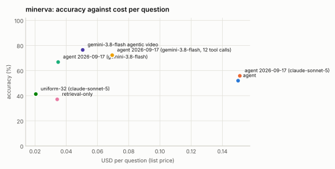

# minerva: 25% stratified sample, seed 1

Generated 2026-09-21 by `eval/report.py` from 8 run file(s). Accuracy is exact match on the option letter; intervals are 95% Wilson. Costs are provider list prices per question; indexing cost is not included for the index-based configurations.

| Configuration | n | accuracy | 95% CI | unparsed | cost / q | tokens / q | tool calls / q | latency p50 | latency p95 | no-decode | citation in range |
|---|---|---|---|---|---|---|---|---|---|---|---|
| agent | 310 | **51.9%** | 46.4–57.4 | 22 | $0.150 | 40,830 | 4.84 | 24.2 s | 76.2 s | 14% | — |
| agent 2026-09-17 (claude-sonnet-5) | 310 | **55.8%** | 50.2–61.2 | 6 | $0.151 | 41,419 | 4.56 | 23.0 s | 92.5 s | 21% | — |
| agent 2026-09-17 (gemini-3.8-flash) | 310 | **66.8%** | 61.4–71.8 | 8 | $0.035 | 33,579 | 4.69 | 22.1 s | 47.0 s | 8% | — |
| agent 2026-09-17 (gemini-3.8-flash, 12 tool calls) | 310 | **72.3%** | 67.0–76.9 | 4 | $0.069 | 69,828 | 6.97 | 28.7 s | 79.3 s | 3% | — |
| agent 2026-09-21 (gemini-3.8-flash, 12 tool calls) | 310 | **69.4%** | 64.0–74.2 | 6 | $0.069 | 68,953 | 6.99 | 24.2 s | 74.8 s | 4% | — |
| retrieval-only | 310 | **37.1%** | 31.9–42.6 | 11 | $0.034 | 8,624 | 1.10 | 11.0 s | 33.0 s | 100% | — |
| uniform-32 (claude-sonnet-5) | 310 | **41.3%** | 35.9–46.8 | 35 | $0.021 | 5,802 | 0.00 | 13.7 s | 22.7 s | 100% | — |
| gemini-3.8-flash agentic video | 310 | **76.5%** | 71.4–80.8 | 6 | $0.051 | 45,673 | 4.08 | 16.2 s | 134.9 s | 100% | — |

## Where this stands against Gemini agentic video

The `gemini-…` row is Google's Gemini 3.8 Flash with `processing: "agentic"` asked the same questions over the same video files through the Interactions API (run once and cached; it is not re-run with every matrix). Google's own announcement ("Introducing agentic video in Gemini", 2026-09-01) reports agentic mode against static whole-video processing on LongVideoBench as up to 88% fewer tokens, up to 66% lower cost and up to 7% higher accuracy, without absolute scores; the numbers here are absolute, on LVBench, and directly comparable across rows because every row answered the same questions under the same scoring. VideoIndex's per-question cost excludes indexing (done once per video); Gemini's per-question cost is the whole cost. Both systems are scored with the same letter parser.

## Accuracy by task type

| Task type | agent | agent 2026-09-17 (claude-sonnet-5) | agent 2026-09-17 (gemini-3.8-flash) | agent 2026-09-17 (gemini-3.8-flash, 12 tool calls) | agent 2026-09-21 (gemini-3.8-flash, 12 tool calls) | retrieval-only | uniform-32 (claude-sonnet-5) | gemini-3.8-flash agentic video |
|---|---|---|---|---|---|---|---|---|
| Cause and Effect | 55% (n=11) | 36% (n=11) | 82% (n=11) | 73% (n=11) | 82% (n=11) | 64% (n=11) | 45% (n=11) | 91% (n=11) |
| Counterfactual | 12% (n=8) | 38% (n=8) | 75% (n=8) | 62% (n=8) | 50% (n=8) | 0% (n=8) | 25% (n=8) | 75% (n=8) |
| Counting | 38% (n=63) | 38% (n=63) | 49% (n=63) | 52% (n=63) | 49% (n=63) | 21% (n=63) | 30% (n=63) | 62% (n=63) |
| Event Occurence | 49% (n=45) | 56% (n=45) | 60% (n=45) | 71% (n=45) | 67% (n=45) | 40% (n=45) | 38% (n=45) | 78% (n=45) |
| Goal Reasoning | 67% (n=3) | 67% (n=3) | 100% (n=3) | 67% (n=3) | 100% (n=3) | 67% (n=3) | 33% (n=3) | 67% (n=3) |
| Listening | 66% (n=32) | 75% (n=32) | 78% (n=32) | 84% (n=32) | 78% (n=32) | 56% (n=32) | 62% (n=32) | 88% (n=32) |
| Numerical Reasoning | 58% (n=12) | 75% (n=12) | 75% (n=12) | 92% (n=12) | 83% (n=12) | 33% (n=12) | 33% (n=12) | 92% (n=12) |
| Object Recognition | 64% (n=56) | 61% (n=56) | 75% (n=56) | 82% (n=56) | 79% (n=56) | 45% (n=56) | 54% (n=56) | 79% (n=56) |
| Reading | 72% (n=29) | 72% (n=29) | 79% (n=29) | 79% (n=29) | 79% (n=29) | 38% (n=29) | 41% (n=29) | 83% (n=29) |
| Situational Awareness | 57% (n=7) | 86% (n=7) | 71% (n=7) | 71% (n=7) | 86% (n=7) | 57% (n=7) | 29% (n=7) | 86% (n=7) |
| Spatial Perception | 36% (n=11) | 45% (n=11) | 55% (n=11) | 55% (n=11) | 64% (n=11) | 36% (n=11) | 27% (n=11) | 73% (n=11) |
| State Changes | 67% (n=3) | 33% (n=3) | 100% (n=3) | 67% (n=3) | 67% (n=3) | 0% (n=3) | 67% (n=3) | 67% (n=3) |
| Temporal Reasoning | 37% (n=30) | 50% (n=30) | 60% (n=30) | 80% (n=30) | 70% (n=30) | 30% (n=30) | 37% (n=30) | 73% (n=30) |

## Tool-call profiles

**agent**: `search > search > view` ×35; `view` ×22; `search > view` ×10; `search > search` ×10; `search > search > view > view > view > view` ×10; `view > view` ×7; `search > search > view > view` ×7; `search > search > search > search > search > view` ×4

**agent 2026-09-17 (claude-sonnet-5)**: `view` ×27; `search > view` ×16; `search > search > view` ×8; `view > view` ×7; `search > search > view > view > view > view` ×6; `search > get_transcript > view` ×5; `search > find_mentions > view` ×5; `search > get_ocr` ×5

**agent 2026-09-17 (gemini-3.8-flash)**: `view` ×19; `search > get_transcript > view > view > view > view` ×7; `search > view > view > view > view > view` ×7; `get_ocr > view` ×6; `search > get_ocr > view` ×6; `view > view` ×5; `view > view > view` ×4; `get_transcript > view` ×4

**agent 2026-09-17 (gemini-3.8-flash, 12 tool calls)**: `view` ×15; `view > view` ×9; `get_ocr > view` ×6; `search > get_ocr > view` ×6; `get_transcript > view` ×5; `view > view > view` ×4; `get_transcript > get_ocr > view` ×4; `search > view > view` ×4

**agent 2026-09-21 (gemini-3.8-flash, 12 tool calls)**: `view` ×18; `view > view` ×6; `view > view > view` ×5; `get_ocr > view` ×5; `get_transcript > view` ×5; `get_transcript > get_ocr > view` ×4; `search > view > view` ×3; `search > find_mentions > get_ocr > view` ×3

**retrieval-only**: `search` ×310

**uniform-32 (claude-sonnet-5)**: `(none)` ×310

**gemini-3.8-flash agentic video**: `processing_call×2` ×78; `processing_call×1` ×55; `processing_call×3` ×46; `processing_call×4` ×40; `processing_call×6` ×26; `processing_call×5` ×18; `processing_call×9` ×10; `processing_call×7` ×9

## Runs

- **agent**: `/data/videoindex/eval/runs/minerva-f0.25-s1-agent.json` — {"benchmark": "minerva", "policy": "agent", "budget_usd": 0.5, "budget_tokens": 120000, "max_tool_calls": 6, "sample": 323, "fraction": 0.25, "seed": 1, "skipped_not_indexed": 13, "vi_version": "vi 0.1.0", "started": "2026-09-14T00:31:11Z"}
- **agent 2026-09-17 (claude-sonnet-5)**: `/data/videoindex/eval/runs/minerva-f0.25-s1-agent-v2.json` — {"benchmark": "minerva", "policy": "agent", "model": null, "label": "agent 2026-09-17 (claude-sonnet-5)", "budget_usd": 0.5, "budget_tokens": 120000, "max_tool_calls": 6, "sample": 323, "fraction": 0.25, "seed": 1, "skipped_not_indexed": 13, "vi_version": "vi 0.1.0", "started": "2026-09-17T15:11:52Z"}
- **agent 2026-09-17 (gemini-3.8-flash)**: `/data/videoindex/eval/runs/minerva-f0.25-s1-agent-gemini.json` — {"benchmark": "minerva", "policy": "agent", "model": "gemini-3.8-flash", "label": "agent 2026-09-17 (gemini-3.8-flash)", "budget_usd": 0.5, "budget_tokens": 120000, "max_tool_calls": 6, "sample": 323, "fraction": 0.25, "seed": 1, "skipped_not_indexed": 13, "vi_version": "vi 0.1.0", "started": "2026-09-17T14:15:52Z"}
- **agent 2026-09-17 (gemini-3.8-flash, 12 tool calls)**: `/data/videoindex/eval/runs/minerva-f0.25-s1-agent-gemini-tc12.json` — {"benchmark": "minerva", "policy": "agent", "model": "gemini-3.8-flash", "label": "agent 2026-09-17 (gemini-3.8-flash, 12 tool calls)", "budget_usd": 0.5, "budget_tokens": 120000, "max_tool_calls": 12, "sample": 323, "fraction": 0.25, "seed": 1, "skipped_not_indexed": 13, "vi_version": "vidx 0.1.0", "started": "2026-09-21T06:24:36Z"}
- **agent 2026-09-21 (gemini-3.8-flash, 12 tool calls)**: `/data/videoindex/eval/runs/minerva-f0.25-s1-agent-gemini-v3-tc12.json` — {"benchmark": "minerva", "policy": "agent", "model": "gemini-3.8-flash", "label": "agent 2026-09-21 (gemini-3.8-flash, 12 tool calls)", "budget_usd": 0.5, "budget_tokens": 120000, "max_tool_calls": 12, "sample": 323, "fraction": 0.25, "seed": 1, "skipped_not_indexed": 13, "vi_version": "vidx 0.1.0", "started": "2026-09-21T07:39:47Z"}
- **retrieval-only**: `/data/videoindex/eval/runs/minerva-f0.25-s1-retrieval-only.json` — {"benchmark": "minerva", "policy": "retrieval-only", "budget_usd": 0.5, "budget_tokens": 120000, "max_tool_calls": 6, "sample": 323, "fraction": 0.25, "seed": 1, "skipped_not_indexed": 13, "vi_version": "vi 0.1.0", "started": "2026-09-14T00:44:31Z"}
- **uniform-32 (claude-sonnet-5)**: `/data/videoindex/eval/runs/minerva-f0.25-s1-uniform-32.json` — {"benchmark": "minerva", "policy": "uniform-32", "model": "claude-sonnet-5", "frames": 32, "transcript": true, "sample": 323, "fraction": 0.25, "seed": 1, "started": "2026-09-13T21:06:31Z"}
- **gemini-3.8-flash agentic video**: `/data/videoindex/eval/runs/minerva-f0.25-s1-gemini-3.8-flash-agentic.json` — {"benchmark": "minerva", "policy": "gemini-agentic", "model": "gemini-3.8-flash", "mode": "agentic", "thinking": null, "sample": 323, "fraction": 0.25, "seed": 1, "started": "2026-09-13T23:29:17Z"}

Questions per run: up to 310. Benchmark videos are public YouTube content and may be in model training data; read per-configuration deltas rather than absolute scores.
